# fleet-management-system

## About the Project

Fleet Management System is a live vehicle-tracking application for a transport company. Imagine a company that runs delivery trucks (lorries) all over the country — this system tracks where each vehicle is, in real time, as it moves around making deliveries.

The idea is simple:

- Each vehicle has a GPS device.
- Every few seconds the vehicle reports its position (latitude and longitude) back to a central server.
- The system stores that data, works out things like the vehicle's speed, and shows everything live on a map in the browser.

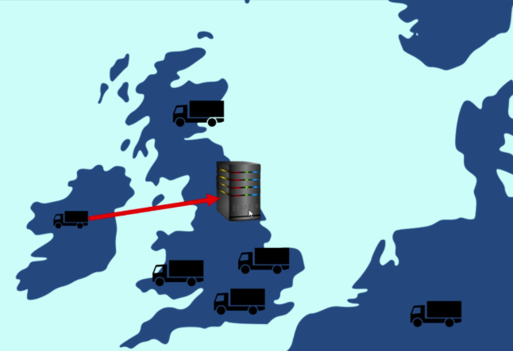

Since there are no real trucks in this demo, the vehicle movement is simulated by one of the services (the Position Simulator), which replays real GPS tracks from data files.

The whole thing is built as a microservices architecture (instead of one big monolith — see [Concepts & Design Decisions](#concepts--design-decisions) below), packaged into Docker containers, and deployed on Kubernetes (AWS EKS).

## How It Works (High Level)

```
Position Simulator  ──>  Queue (ActiveMQ)  ──>  Position Tracker  ──>  MongoDB
                                                      ▲
                                                      │
                     Webapp (browser map)  ──>  API Gateway
```

#### The 5 Microservices

| Service | Tech |
|---------|------|
| **Position Simulator** | Java / Spring Boot |
| **Queue** | ActiveMQ |
| **Position Tracker** | Spring Boot + MongoDB |
| **API Gateway** | Spring Boot + Feign + Hystrix |
| **Webapp** | Angular 6 + Leaflet + nginx |

1. The Position Simulator pretends to be the moving vehicles and keeps sending their positions to a queue.
2. The Queue (ActiveMQ) holds those position messages so services stay decoupled.
3. The Position Tracker reads messages off the queue, calculates speed, stores history in MongoDB, and exposes a REST API.
4. The API Gateway is the single entry point the frontend talks to; it forwards requests to the right backend service.
5. The Webapp (Angular) shows the vehicles moving live on a map, with a list and route history.

---

# How Each Part Works

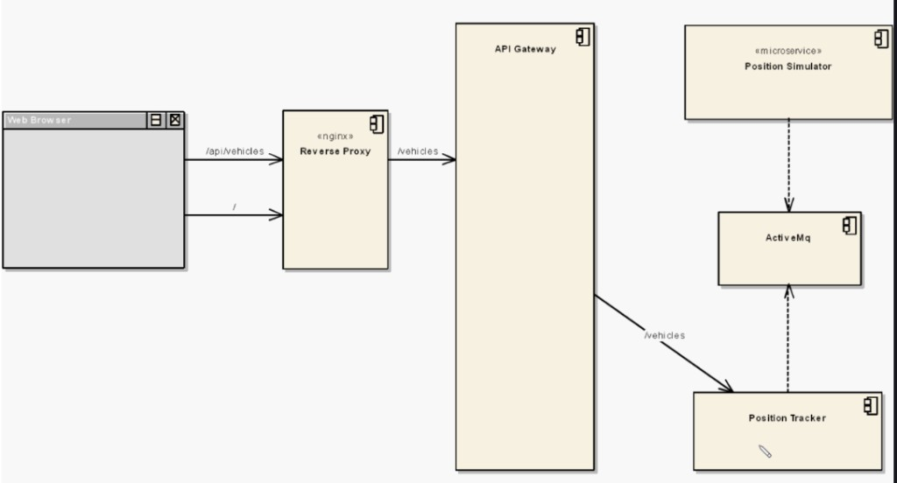

## Position Simulator

This microservice simulates the vehicles moving around the country.

- When it starts up, it reads in a series of files. Those files contain test data that represents vehicle journeys.
- It runs in an infinite loop, and every few seconds it reads the next position from a file.
- Each file represents a single vehicle, and the name of the file becomes the name of the vehicle. To add more vehicles, you just add more files.
- Each file holds a long series of latitudes and longitudes — real GPS tracks recorded earlier.
- A microservice should do only one thing, and this one's single job is to simulate vehicle positions.
- Once it reads a position, it hands that data off to the queue (ActiveMQ). Because it runs forever and keeps producing new data over time, a queue is the natural way to handle this steady stream.

## Queue — ActiveMQ

A queue is a very common part of a microservice architecture. It lets us send data across the system without coupling the microservices together.

- The Producer is the service sending messages to ActiveMQ — here, the Position Simulator.
- The Consumer is the service receiving messages from the broker — here, the Position Tracker.
- ActiveMQ is a message broker. When a message is sent in, it's "enqueued"; when a consumer reads it, it's "dequeued".

How the consumer actually receives messages:

1. The consumer (Position Tracker) connects and subscribes to the queue (`positionQueue`), creating a connection/session/consumer.
2. The broker (ActiveMQ) pushes messages to that consumer over the open TCP connection.
3. The consumer acknowledges (ACKs) the message. Only then does the broker treat it as successfully consumed.

## Position Tracker

This is the most important microservice and does the real heavy lifting.

- Its job is to read positions from the queue and run calculations on them, such as working out the speed of each vehicle.
- It also acts as a repository for vehicles, storing the history of where each vehicle has been.
- It exposes a REST interface so clients can fetch vehicle details:
  - `/vehicles` — all vehicles
  - `/vehicles/{vehicle-name}` — a single vehicle, e.g. `/vehicles/City%20Truck` (`%20` is the escaped space in "City Truck")
- Because it does the heavy work, this is the service that needs scaling in production (the simulator just generates data).

Storing history:

- The position history needs to be saved somewhere so it survives restarts. Originally it was kept in-memory (RAM), but that is not persistent.
- So the tracker stores history in MongoDB instead.
- The data is just a large collection of JSON-like documents with nothing relational about it, which makes MongoDB (a simple document database) a good fit.

## API Gateway

The frontend needs to talk to the backend, but in a microservice architecture we never let the frontend talk to the microservices directly.

Why not? Because the backend is in a constant state of flux. Microservices keep changing — they grow more complex, and their number goes up and down over time. A service like the Position Tracker might get so complex that we later split it into two services, or two small services might get merged into one. If the frontend talked to the microservices directly, every one of these backend changes would force a change in the frontend too.

So there should always be something in between that acts as a router between the frontend and the microservices. That something is a backend, and here we call it an API Gateway. Whether you call it a backend or an API Gateway, its purpose is the same: sit between the frontend and the microservices and route each request to the right service. It already knows how to talk to the microservices, so the frontend doesn't have to.

How it works here:

- The gateway is the single point of entry to the entire application — the frontend only ever talks to the gateway.
- Its job is to delegate each incoming call to the appropriate microservice.
- It uses simple mapping logic to decide where a request should go. For example, the frontend makes a REST call to `/api/vehicles`; the gateway intercepts it and, because it ends in `/vehicles`, forwards it to the Position Tracker.
- This keeps the frontend isolated from backend changes. As engineers add, split, or merge microservices, they only update the gateway's mapping — the frontend doesn't have to change.

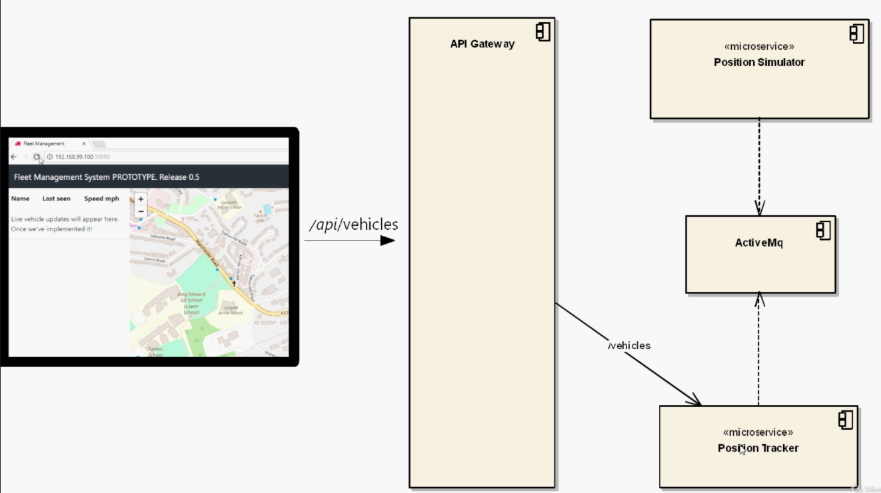

## Webapp

This is the user-facing part — a JavaScript single-page app built with Angular and served by an nginx web server.

- It shows the vehicles moving live on a map (using Leaflet).
- It lists the vehicles with details like name, last-seen time, and speed.
- When you select a vehicle, it draws the route history — the path the vehicle took from its start point to its current position.
- It only communicates with the API Gateway, never with the backend microservices directly.

---

# Concepts & Design Decisions

## Monolith vs Microservices

This Java application is a microservice-based app. But why have we shifted from the traditional monolith to a microservices architecture?

### Monolith

The traditional architecture is called a monolith — the entire system is deployed as a single unit.

- For a Java web application, this means a single WAR file containing the entire project.
- In real cases that WAR file doesn't fulfil just one business need — it fulfils many (e.g. a shopping site has product, cart, inventory, payment, and more), and these requirements keep growing.
- A global database backs the whole application, and every business area reads and writes to that same database.
- Often this database is even shared by other monolithic applications — a shared database like this is called an Integration Database.

#### Problems with the monolithic architecture

- The monolith eventually gets bloated — too big to manage easily.
- It becomes harder to change one business area without accidentally breaking another.
- As it grows, multiple teams end up working on the same application and start cutting across each other — changing the inventory means consulting other colleagues so you don't break their work.
- All the code is combined and deployed as one application, so shipping a single change means coordinating and releasing the entire monolith — which is slow.
  - For example, if I have to deploy a new change in inventory, I can't just ship that on its own — I have to wait, coordinate with other colleagues, and release the changes as one whole application, which is slow.

### Microservices

Microservices are about modularity and isolation — we break the entire system into self-contained, isolated components.

- Each microservice has separate code in a separate repo, and can be developed, deployed, and run on its own.
- They can run on their own hardware/server; the good practice is to deploy each microservice as a separate container.
- A microservice stays self-contained throughout its lifetime — changing the code of one does not affect another, since there's no direct code link or visibility between them.
- Microservices communicate via REST API calls (and can also pass messages between each other).
- Each microservice should be responsible for one business requirement.

#### Highly Cohesive and Loosely Coupled

Each microservice should be highly cohesive and loosely coupled.

- Highly cohesive — a microservice has a single set of responsibilities / handles one business requirement (e.g. payment service, authentication service, mailing service).
- Loosely coupled — minimize the interfaces (the service-to-service communication) between microservices. Tangled dependencies between many services defeat the purpose. But maintaining loose coupling is hard.

#### Databases in microservices

- Integration (shared) databases are not good for a microservice architecture:
  - They are not cohesive by design — they hold many different business areas.
  - They are not loosely coupled — any part of the system, and even other systems, can read and write to them.
- Each microservice should maintain its own database, and only that microservice can read and write to its own data store.
- Different microservices can use different types of databases (relational, NoSQL/big-data stores, etc.) as best suits their needs.

---

# Deployment on AWS EKS

## Creating the AWS Infrastructure

All of the AWS infrastructure for this project is provisioned with Terraform. The main building blocks are summarised below.

#### Prerequisites

| Tool | Why it's needed |
|------|-----------------|
| Terraform | To provision the AWS infrastructure as code |
| AWS CLI | To configure AWS credentials/profiles and talk to AWS |
| kubectl | To interact with the Kubernetes (EKS) cluster |
| Docker | To build and push the service images |
| Helm | Optional — only if you want to **manually** deploy the apps to test. (Actual app deployment is handled by **CodePipeline**, and cluster add-ons are installed by **Terraform**.) |

#### Terraform

| Item | Detail |
|------|--------|
| Layers | The Terraform is split into two layers, each applied independently: the **infra layer** (`Infrastructure/main` — VPC, EKS, ECR, MQ, etc.) and the **addons layer** (`Infrastructure/addons` — cluster add-ons like External Secrets Operator and the AWS Load Balancer Controller, which need the cluster to exist first). Each layer has its own state, tfvars, and workspace |
| Workspace | Each layer uses its own Terraform workspace (both named `fleetman-prod`), keeping their state isolated |
| Backend (`backends/prod-backend.tfbackend`) | The backend is where Terraform keeps its state file — the record of every resource it has created and their current values. State is stored remotely in a single S3 bucket, encrypted and versioned, but **each layer writes a separate state file** (a different `key`), so the layers never clash |
| Variables (`prod-terraform.tfvars`) | The setup is parametrized — **each layer has its own tfvars** holding the values for its Terraform variables (region, CIDRs, names, feature toggles, etc.), so the same code can be reused across environments |
| Modules | Official [`terraform-aws-modules`](https://github.com/terraform-aws-modules) are used for most resources (VPC, EKS, ECR, IAM); custom modules were written for the rest (e.g. CloudFront, EKS add-ons) |
| Creation toggles | Every AWS resource is gated behind a boolean toggle in tfvars (e.g. `create_vpc`, `create_eks_cluster`, `create_ecr_repository`). A resource is created **only when its toggle is `true`**, so individual parts of the stack can be turned on or off without changing any code |
| Fully automated (no manual steps) | Nothing is created by hand in the console or CLI — **everything is provisioned through Terraform**. This includes the addons layer: **Helm chart installation** (External Secrets Operator, AWS Load Balancer Controller), **Kubernetes namespace creation**, and **IRSA setup** (the IAM roles for service accounts *and* the service-account annotations that bind them) |

<sub>**[more on terraform →](#using-terraform-for-infra-creation)**</sub>

#### AWS and Other Services

| Service | Why it's used |
|---------|---------------|
| [EKS cluster](#deploying-eks-cluster) | The Kubernetes cluster the backend services (API Gateway, Position Tracker, Position Simulator) are deployed on |
| [VPC](#vpc) | EKS lives inside its own Virtual Private Cloud (private network) |
| [ECR](#ecr) | Stores the Docker images for our services |
| [Amazon MQ](#deploying-the-queue--amazon-mq) | Managed message broker for our queue |
| [MongoDB Atlas](#mongodb-atlas) | Managed MongoDB for storing vehicle position history |
| IAM | Identities, roles, and permissions for the cluster, nodes, and pods |
| [Secrets Manager](#handling-environment-variables) | Stores the services' sensitive config (broker credentials, MongoDB URI), synced into the cluster by the External Secrets Operator |
| [CodePipeline](#cicd-with-codepipeline) | CI/CD — builds the service images and deploys them to the cluster |
| ACM (public certificate) | Public TLS certificate for HTTPS, used by the load balancer and CloudFront |
| Route 53 | DNS — hosts the domain's records (e.g. the API Gateway host pointing at the ALB) |
| Load Balancer | Part of the Load Balancer Controller — exposes the API Gateway (and any other service we want to expose) |
| CloudFront | CDN in front of both the webapp and the API Gateway |

#### IAM

| User | Purpose |
|------|---------|
| devops | Used for infrastructure creation via Terraform |

#### EKS

| Component | Detail |
|-----------|--------|
| Control plane | Completely managed by AWS — we cannot access or scale it ourselves |
| Data plane | AWS-managed node group (AWS handles node creation) — where our application pods are deployed |
| IRSA | IAM Roles for Service Accounts — gives individual pods their own least-privilege AWS permissions through their Kubernetes service account |
| IAM roles | Roles for the EKS cluster and the worker node group |

[EKS add-ons installed:](#eks-add-ons)

**Managed EKS add-ons** (installed via the EKS API, from the `eks_addons` map in the infra layer):

- CoreDNS — in-cluster DNS for service discovery
- eks-pod-identity-agent — lets pods assume IAM roles (pod identity)
- kube-proxy — manages network routing rules on each node
- vpc-cni — assigns VPC IP addresses to pods

**Helm-installed cluster add-ons** (installed by the addons layer via Terraform's Helm provider):

- External Secrets Operator (ESO) — syncs secrets from AWS Secrets Manager into Kubernetes Secrets
- AWS Load Balancer Controller — provisions an ALB from Kubernetes Ingress resources

#### S3

We need two S3 buckets:

| Bucket | Purpose | Created by |
|--------|---------|-----------|
| `fleetman-tf-state` | Stores the Terraform state file | Manually (it must already exist before Terraform can use it as its backend) |
| `fleetman-codepipeline-artifacts` | Stores the artifacts passed between the stages of the AWS CodePipeline | Terraform |

#### How Each Service Is Deployed

| Service | Deployment |
|---------|-----------|
| Webapp | Static SPA served via CloudFront + S3 |
| Position Simulator, Position Tracker, API Gateway | Kubernetes Deployments in the [EKS cluster](#deploying-eks-cluster) |
| Queue | [Amazon MQ](#deploying-the-queue--amazon-mq) (managed ActiveMQ) |
| MongoDB (for Position Tracker) | [MongoDB Atlas](#mongodb-atlas) (managed) |

---

# Using Terraform for Infra Creation

**Why Terraform?** Terraform lets us define all of the AWS infrastructure as code instead of clicking around the console by hand. The biggest reason I chose it is how it manages **state**.

Terraform works on the idea of **desired state vs current state**:

- The **desired state** is what we declare in our `.tf` files — the infrastructure we *want* to exist.
- The **current state** is what actually exists, which Terraform tracks in a **state file**.
- When we run `terraform plan` / `apply`, Terraform compares the two and works out the difference, then makes only the changes needed to bring the real infrastructure in line with our code (creating, updating, or destroying resources as required).

This gives us infrastructure that is reproducible, version-controlled, reviewable, and easy to tear down and recreate — and it avoids configuration drift, because the state file is the single source of truth for what Terraform manages.

### Two layers: infra + addons

The Terraform is split into **two independently-applied layers**, each with its own state file (a different `key` in the same S3 bucket), its own `prod-terraform.tfvars`, and its own `fleetman-prod` workspace:

- **Infra layer (`Infrastructure/main`)** — the core AWS infrastructure: VPC, EKS cluster, ECR, Amazon MQ, Route 53, ACM, CodePipeline, etc.
- **Addons layer (`Infrastructure/addons`)** — things that live *inside* the cluster and therefore need it to exist first: Helm releases (External Secrets Operator, AWS Load Balancer Controller), Kubernetes namespaces, and IRSA (IAM roles for service accounts + their service-account annotations).

**Why split them?** The addons layer configures the **`kubernetes` and `helm` providers**, which need the cluster's API endpoint and auth — and those don't exist until the EKS cluster is created. Pointing those providers at a cluster created in the *same* apply is the classic chicken-and-egg problem (a provider's configuration can't depend on a resource built in the same run). Splitting into layers fixes that: apply **infra** first to build the cluster, then apply **addons** against the now-existing cluster. It also keeps the blast radius small — add-ons can be changed or destroyed without touching the core infrastructure.

And it's all **100% Terraform — no manual `kubectl`, `helm`, or console steps**. The addons layer installs the Helm charts, creates the namespaces, and wires up IRSA (the IAM roles *and* the service-account annotations that bind them) entirely as code.

### Directory Structure

The `Infrastructure/` directory is organised into **two root modules (the layers)** and reusable child modules shared by both (only the key files are shown):

```
Infrastructure/
├── main/                            # INFRA layer (root module) — VPC, EKS, ECR, MQ, ...
│   ├── init.tf                      # aws provider + version setup
│   ├── backend.tf                   # Remote S3 backend declaration
│   ├── variables.tf                 # Variable definitions
│   ├── prod-terraform.tfvars        # Variable values for the prod environment
│   ├── backends/
│   │   └── prod-backend.tfbackend   # Backend config (key: prod/terraform.tfstate)
│   ├── vpc.tf                       # Calls the vpc module
│   ├── eks.tf                       # Calls the eks module
│   ├── ecr.tf                       # Calls the ecr module
│   ├── cloudfront.tf
│   ├── route53.tf
│   ├── acm.tf
│   └── output.tf
│
├── addons/                          # ADDONS layer (root module) — runs AFTER the cluster exists
│   ├── init.tf                      # aws + kubernetes + helm + kubectl providers
│   ├── prod-terraform.tfvars        # Addons variable values
│   ├── backends/
│   │   └── prod-backend.tfbackend   # Separate state (key: prod/eks-addons.tfstate)
│   ├── helm.tf                      # Helm releases (ESO, ALB controller)
│   ├── k8s-ns.tf                    # Kubernetes namespaces
│   ├── k8s-external-secrets-operator.tf
│   └── load-balancer-controller.tf
│
└── modules/                         # Reusable child modules (shared by both layers)
    ├── vpc/
    ├── eks/
    ├── ecr/
    ├── cloudfront/
    ├── static-cloudfront/
    ├── acm/
    ├── iam-module/
    ├── helm/
    └── k8s-modules/                 # namespaces, service accounts, kubectl manifests
```

Each layer (`main/` and `addons/`) is a root module that wires everything together by calling the child modules under `modules/`, passing in the values from its own `prod-terraform.tfvars`.

### Root Module vs Child Modules

A quick note on terminology, since this setup has modules calling other modules:

- **Root module** — the top-level folder where you actually run Terraform. Here that's `Infrastructure/main/`. There is only ever one root module.
- **Child module** — any module that is called by another module. Everything under `modules/` is a child module.

In this project there's an extra layer, because my own modules wrap the official ones:

```
root (main/)  →  my module (modules/vpc)  →  official module (terraform-aws-modules/vpc/aws)
```

- `main/` is the **root**.
- `modules/vpc` is a **child** of the root — and at the same time it's the **parent (caller)** of the official module.
- The official `terraform-aws-modules/vpc/aws` is a **nested child** (a child of my child).

So "root" only ever refers to `main/`; anything inside `modules/` is a child, no matter how many layers deep the calls go.

### init.tf

This is the provider setup. Always pin the official AWS provider version so the builds stay reproducible.

```hcl
terraform {
  required_providers {
    aws = {
      source  = "hashicorp/aws"
      version = "6.35.1"
    }
  }
}

provider "aws" {
  region = var.region
}
```

### Backend — prod-backend.tfbackend

The S3 bucket that holds the state must be created beforehand. **Each layer has its own backend config with a different `key`**, so the two layers keep separate state files in the same bucket:

```hcl
# Infrastructure/main/backends/prod-backend.tfbackend   (infra layer)
bucket  = "fleetman-tf-state"
key     = "prod/terraform.tfstate"
region  = "us-east-1"
encrypt = true

# Infrastructure/addons/backends/prod-backend.tfbackend  (addons layer)
bucket  = "fleetman-tf-state"
key     = "prod/eks-addons.tfstate"   # different key -> separate state, same bucket
region  = "us-east-1"
encrypt = true
```

### Deploying the Infrastructure

Clone the repo:

```bash
git clone https://github.com/priyanshi-sarad2/fleet-management-system.git
```

Create an IAM user with the permissions needed for infrastructure creation, then set up an AWS profile for it:

```bash
aws configure --profile fleetman-prod
```

Go into the root module and export the profile. The AWS account ID is kept out of version control, so it's passed in as an environment variable (`TF_VAR_account_id`), which Terraform automatically maps to the `account_id` variable:

```bash
cd Infrastructure/main
export AWS_PROFILE=fleetman-prod; export TF_VAR_account_id=<your-aws-account-id>
```

Initialise Terraform with the backend config:

```bash
terraform init -backend-config=backends/prod-backend.tfbackend
```

Create and select a workspace:

```bash
terraform workspace new fleetman-prod
terraform workspace select fleetman-prod
terraform workspace show
```

Review the plan, then apply:

```bash
terraform plan -var-file=prod-terraform.tfvars
terraform apply -var-file=prod-terraform.tfvars
```

Once the cluster is up, deploy the **addons layer** the same way — it has its own init, workspace, and tfvars, and runs against the cluster the infra layer just created:

```bash
cd ../addons
export AWS_PROFILE=fleetman-prod; export TF_VAR_account_id=<your-aws-account-id>

terraform init -backend-config=backends/prod-backend.tfbackend
terraform workspace new fleetman-prod      # or: terraform workspace select fleetman-prod
terraform apply -var-file=prod-terraform.tfvars
```

> **Order matters:** apply **infra → addons**. When tearing down, destroy **addons → infra** (the add-ons need the cluster alive to be removed cleanly).

---

# VPC

A VPC (Virtual Private Cloud) is a private, isolated network inside AWS that we fully control.

A key thing about a VPC is that every resource inside it can talk to every other resource over private IPs, simply because they are all part of the same network (subject to security groups and network ACLs) — no traffic needs to go over the public internet for them to reach each other.

For this project we create our own dedicated VPC. One thing worth noting: the **EKS control plane** runs in a **separate, AWS-managed VPC** that we don't see or control. Only the **data plane** — our worker nodes and the application pods — is deployed into the VPC we create here.

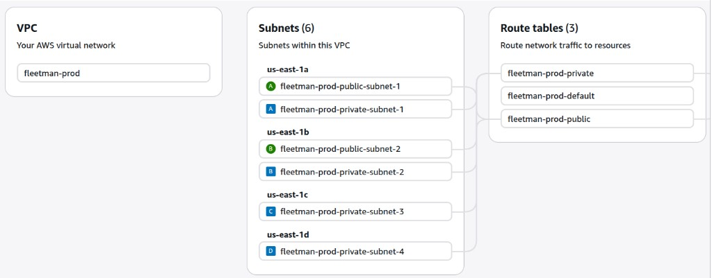

### Subnets, CIDR and Availability Zones

A subnet is a smaller slice of the VPC's IP range. Two ideas make this clearer:

- **CIDR block** — the range of private IP addresses a network owns. Our VPC is given the CIDR `10.2.0.0/16`, which covers `10.2.0.0` – `10.2.255.255` (around 65,000 addresses). Every subnet then carves out a smaller piece of this range.
- **Availability Zone (AZ)** — a physically separate data centre within the region. Each subnet lives in exactly one AZ. Spreading subnets across multiple AZs (`us-east-1a`, `1b`, `1c`, `1d`) gives high availability — if one AZ goes down, resources in the others keep running.

We split the VPC range into public and private subnets, each a `/24` block (256 addresses):

**Public subnets (2)** — `10.2.1.0/24` and `10.2.2.0/24`. A public subnet has a route to the internet through the internet gateway, so resources here can be reached from the internet and can reach out to it. Resources here can be given a **public IP** (in addition to their private IP), which is the address the outside world uses to reach them. We use these subnets for the **load balancer** and the **NAT gateway**. Because the load balancer sits in a public subnet, it is internet-facing and gets a **public DNS name** (and public IP) — this is the entry point users actually hit from the internet, and it then forwards the traffic inward to the pods running in the private subnets. (Two public subnets are used, in two different AZs, because an internet-facing load balancer needs a subnet in each AZ it serves.)

**Private subnets (4)** — `10.2.10.0/24`, `10.2.11.0/24`, `10.2.12.0/24`, `10.2.13.0/24`. A private subnet has **no** direct route to the internet. Resources here only get a **private IP** (an address that is only reachable from inside the VPC) and no public IP, so nothing on the internet can address them directly. This is where the **EKS worker nodes and the application pods run**, and the **Amazon MQ (ActiveMQ) broker is also deployed here** in a private subnet. Keeping them private is more secure — incoming traffic has to go through the load balancer in the public subnet first, and outbound traffic goes out via the NAT gateway.

### Internet Gateway

An internet gateway is what connects the VPC to the public internet. Without it, even the public subnets would have no way in or out.

We need it so that resources in the **public subnets** (like the load balancer and the NAT gateway) can send and receive traffic to and from the internet. It's attached to the VPC, and the public route table sends internet-bound traffic to it.

### NAT Gateway

The pods and nodes live in **private subnets**, which have no route to the internet. But they still need **outbound** internet access — for example, to pull container images, download packages, or call external APIs. Without a NAT gateway, apps inside the pods would have no internet access at all.

This is what the NAT (Network Address Translation) gateway solves:

- The NAT gateway sits in a **public subnet** and is given an **Elastic IP** (a fixed public IP address).
- When a pod in a private subnet wants to reach the internet, its traffic is routed to the NAT gateway.
- The NAT gateway swaps the pod's private source IP for its own Elastic IP and sends the request out through the internet gateway.
- Return traffic comes back to the NAT gateway, which forwards it to the right private resource.

The important property is that it only allows **outbound** connections — the internet can't start a connection *into* the private subnets through the NAT gateway. So pods get internet access for pulling things they need, while staying unreachable from outside.

### Route Tables

A route table is a set of rules that decides where network traffic is sent. Each subnet is associated with one route table.

**Public route table** — associated with the public subnets. It has a route that sends internet-bound traffic (`0.0.0.0/0`) to the **internet gateway**, which is what makes those subnets "public".

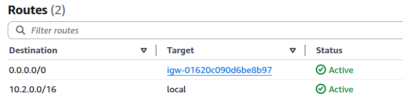

**Private route table** — associated with the private subnets. Its internet-bound traffic (`0.0.0.0/0`) is sent to the **NAT gateway** instead. This is how private resources get outbound internet access without being directly exposed to the internet.

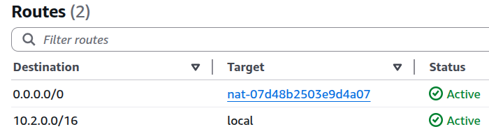

---

# ECR

ECR (Elastic Container Registry) is AWS's private Docker image registry. After we build the Docker image for a service, we push it to ECR, and the EKS cluster pulls the image from there when it deploys the pods.

We use **3 ECR repositories — one for each of the 3 services that run in the cluster** (Position Simulator, Position Tracker, API Gateway). Keeping a separate repository per service keeps their images cleanly isolated and independently versioned.

### How images are built, tagged, and pushed

Image creation and push are **fully automated by CodePipeline** — on a code change, the **CodeBuild build stage** builds the Docker image and pushes it to ECR (no manual `docker build`/`push`). Each build generates a unique tag in the build stage:

```bash
TAG="v${CODEBUILD_RESOLVED_SOURCE_VERSION:0:5}-$(date +%I-%M-%y-%m-%d)"
```

So a tag looks like **`v9b0d4-04-12-26-06-23`**, made of:
- a **`v`** prefix (so it's matched by the ECR lifecycle policy below),
- the **first 5 characters of the commit SHA** that triggered the pipeline (`CODEBUILD_RESOLVED_SOURCE_VERSION`) — ties the image back to the exact source commit, and
- a **timestamp** (`HH-MM-YY-MM-DD`) — keeps each build's tag unique and time-ordered.

The tag is also written to `image-tag.txt` and passed to the deploy stage, so Helm deploys the exact image that was just built.

### Image retention

Since this is a production setup, we don't want to keep every image forever — old images pile up and add storage cost. So each repository has a **lifecycle policy** that keeps only the most recent images and automatically deletes the older ones.

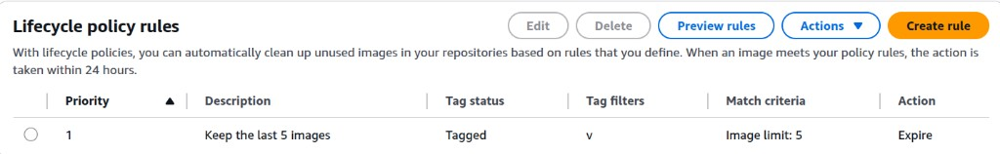

Looking at the lifecycle policy rule above:

- We keep the **latest 5 images**. Five is a sensible production default — enough history to roll back a few versions if a deploy goes wrong, without letting images grow unbounded.
- Only images whose tag starts with **`v`** are counted — which is exactly how CodeBuild tags them (`v<commit>-<timestamp>`). This is the `tagPrefixList = ["v"]` part of the rule.
- The rule type is "more than N" (`imageCountMoreThan`), so once a repository has **more than 5** such tagged images, the rule's action is to `expire` (delete) the **oldest** images beyond the newest 5.

How a delete actually happens: each pipeline run pushes a new `v…` image. Once 5 builds exist, all 5 are kept; the moment the **6th** build is pushed, the repository has more than 5 images — so the **oldest** one is automatically expired, always leaving the 5 most recent builds.

### Security: image scanning

ECR can scan images for known vulnerabilities (CVEs). I've enabled **Basic scanning** with **scan-on-push** on the registry, so every image is automatically scanned for OS-package vulnerabilities the moment it's pushed.

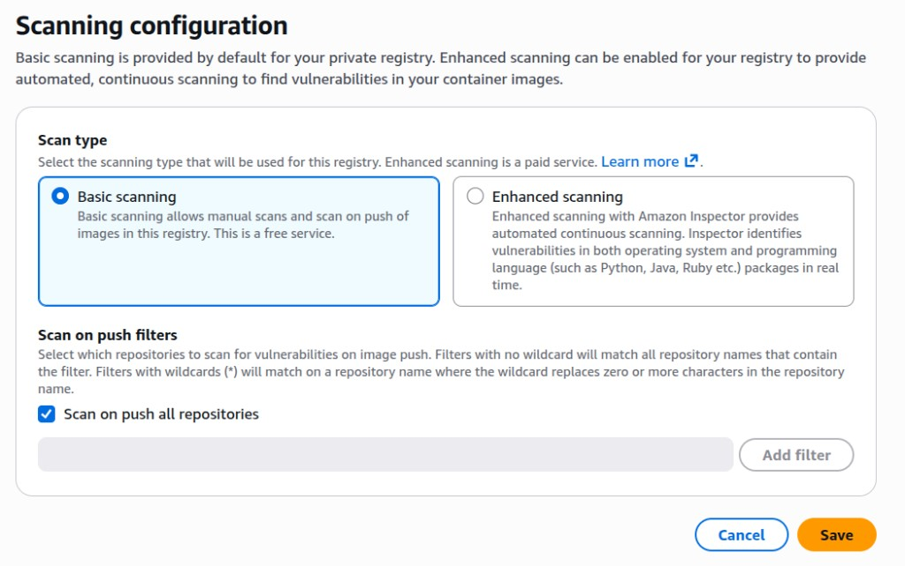

- **Basic scanning is free** — it scans against the open-source CVE database at no cost, so there's no reason not to turn it on.
- **Scan on push** means results are ready right after each CodePipeline build, surfacing vulnerable images immediately.
- For deeper, *continuous* scanning of both OS and programming-language packages, AWS offers **Enhanced scanning** (Amazon Inspector) — but that's a **paid** service; Basic is enough for this project.

**Recommendation: always enable Basic scanning** — it's free and an easy security win.

---

# Deploying the Queue — Amazon MQ

**What is Amazon MQ?** Amazon MQ is a managed message-broker service from AWS. Instead of running and maintaining a message broker yourself, AWS runs popular open-source brokers for you — **ActiveMQ** and **RabbitMQ** — and handles the servers, storage, patching, and availability.

**Why Amazon MQ with the ActiveMQ engine?** The application already speaks **ActiveMQ** — the Position Simulator and Position Tracker connect using JMS/OpenWire (via `spring-boot-starter-activemq`). Amazon MQ's ActiveMQ engine is a managed, drop-in replacement for a self-hosted ActiveMQ broker: we get the same protocol and the same app behaviour, but without managing the broker ourselves — and **without rewriting any application code**. (A native AWS option like SQS would have meant rewriting the producer and consumer, since SQS isn't JMS — Java Message Service.)

### The broker

- A single-instance ActiveMQ broker (`mq.t3.micro`, engine version `5.19`), named **`fleetman-mq`**.
- It is deployed **inside a private subnet** of our VPC and is **not publicly accessible** — so it can only be reached from within the VPC, never from the internet.
- Its security group allows inbound traffic on **port `61617`** (OpenWire over TLS — the port JMS uses). This is what lets both the **Position Simulator** (producer) and the **Position Tracker** (consumer) reach the broker to send and receive messages.
- Two users are created: an **admin** user (web-console access) and an **application** user (`fleetman-app`) that the services use to connect. The passwords are auto-generated and stored securely in **SSM Parameter Store** (the password as an encrypted SecureString).

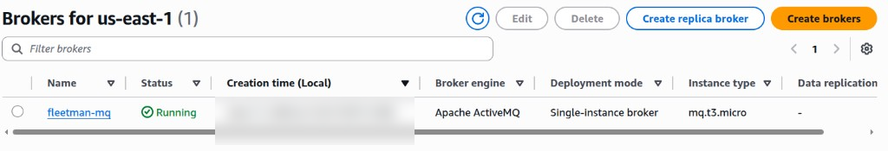

### How the apps connect to the broker

Both the Position Simulator and the Position Tracker connect to the **same** broker, so **both** services need the same three values, supplied as environment variables:

| Variable | Purpose |
|----------|---------|
| `ACTIVEMQ_BROKER_URL` | The broker's OpenWire TLS endpoint, e.g. `ssl://b-xxxx-xxxx.mq.us-east-1.amazonaws.com:61617` |
| `ACTIVEMQ_USER` | The application username (`fleetman-app`) |
| `ACTIVEMQ_PASSWORD` | The application user's password (read from SSM) |

These are configured in each service's properties file:

- `k8s-fleetman-position-simulator/src/main/resources/application-production-microservice.properties`
- `k8s-fleetman-position-tracker/src/main/resources/application-production-microservice.properties`

Both files have the same three lines, each reading from an environment variable:

```properties
spring.activemq.broker-url=${ACTIVEMQ_BROKER_URL:tcp://fleetman-queue.default.svc.cluster.local:61616}
spring.activemq.user=${ACTIVEMQ_USER:}
spring.activemq.password=${ACTIVEMQ_PASSWORD:}
```

If the env vars aren't set, the apps fall back to the old in-cluster broker URL with no credentials (used for local development).

### Getting the broker credentials

The broker passwords are auto-generated and stored in **SSM Parameter Store** (as encrypted `SecureString`s), so they never live in the repo. Retrieve the application user's password with:

```bash
aws ssm get-parameter \
  --name "/mq/mq_application_password" \
  --with-decryption \
  --query "Parameter.Value" \
  --output text \
  --profile fleetman-prod --region us-east-1
```

For the admin password (web console), use `/mq/mq_admin_password` instead. The `--with-decryption` flag is required because the values are stored as encrypted `SecureString`s. The usernames are stored alongside them at `/mq/mq_application_username` and `/mq/mq_admin_username`.

---

# MongoDB Atlas

**What is MongoDB?** MongoDB is a NoSQL **document database**. Instead of tables and rows like a relational database, it stores data as flexible, JSON-like documents.

**Why MongoDB for this project?** The Position Tracker needs to store the **history of where every vehicle has been**. Each record is a simple JSON-like document — vehicle name, latitude, longitude, timestamp, and speed. This history is just a large, ever-growing collection of such documents with nothing relational about it, so a document database is a natural fit. It also lets the tracker keep the history **durably** instead of in memory (which is lost whenever the pod restarts).

**Why MongoDB Atlas?** Atlas is MongoDB's fully-managed cloud service. Rather than running and maintaining MongoDB ourselves inside the cluster — handling storage, backups, upgrades, and availability — Atlas manages all of that for us, and the Position Tracker simply connects to it.

### How the Position Tracker connects

The connection is configured in the Position Tracker's properties file:

`k8s-fleetman-position-tracker/src/main/resources/application-production-microservice.properties`

```properties
spring.data.mongodb.uri=${MONGODB_URI:mongodb://fleetman-mongodb.default.svc.cluster.local:27017/fleetman}
```

- The URI comes from the **`MONGODB_URI`** environment variable, supplied to the pod (ideally from a Kubernetes Secret), so the connection string — which contains the password — never lives in the repo.
- For Atlas, `MONGODB_URI` is set to the SRV connection string, e.g. `mongodb+srv://fleetman:<password>@fleetman.xxxxx.mongodb.net/fleetman?appName=fleetman`.
- If `MONGODB_URI` isn't set, it falls back to the in-cluster MongoDB URL, which is handy for local development.

### Making the MongoDB connection secure

Atlas is reachable over the internet, so by default anyone with the credentials could try to connect. To lock it down, Atlas has a **Network Access → IP Access List**, where we add **only our VPC's NAT gateway Elastic IP**.

Why the NAT Elastic IP?

- The Position Tracker pods run in **private subnets**, which have no direct internet access.
- To reach Atlas (which lives outside the VPC, on the internet), the pods make an **outbound** connection — and since they're in private subnets, that traffic goes out through the **NAT gateway**.
- The NAT gateway uses a fixed **Elastic IP**, so from Atlas's point of view, every connection from our cluster appears to come from that one IP. The Elastic IP matters because it is **static** — it stays the same, so it's safe to allowlist.

The IP is added as a **`/32`** entry (e.g. `<nat-eip>/32`). A `/32` CIDR means **exactly one IP address** — a single host — so only that precise address is allowed, nothing wider.

By adding only this IP to the access list, the Atlas cluster can **only be reached from our cluster's NAT IP** — nothing else on the internet can connect to it, even with the password.

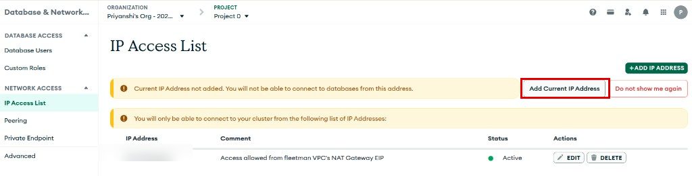

**Connecting from your own machine (testing/admin):** the list above only allows the cluster's NAT IP, so your laptop can't connect by default. To connect from where you are now, open **Network Access → IP Access List** and click **"Add Current IP Address"** (highlighted above) — Atlas adds your current public IP to the allowlist.

**Giving developers access:** to let developers connect to Atlas from their own machines, add their IPs to the same list. If your team uses an **office VPN**, just allowlist the **office/VPN egress IP** once — then anyone on the VPN can reach Atlas, without adding each developer's IP individually.

---

# Deploying EKS cluster

An EKS cluster has two major components: the **control plane** and the **data plane**.

## Control plane

The control plane is **completely managed by AWS** — we don't provision, access (SSH into), or scale it ourselves. AWS runs it on its **own separate infrastructure** (a separate AWS-managed account/VPC, not our VPC) and takes care of the kube-api server, etcd, scheduler, and controller manager, along with their high availability and patching.

A key billing point: the control plane has a **flat hourly rate**. Even if we have **zero worker nodes** and aren't running any workloads, we're charged for the control plane for as long as the cluster exists. So a cluster that's just sitting idle still costs money — worth remembering when you spin clusters up for practice.

## Data plane

The data plane is the **worker nodes where the pods actually run**. EKS gives three options for it:

- **Self-managed node group** — you create and manage the EC2 instances yourself (most control, most operational work).
- **AWS-managed node group** — AWS provisions and manages the lifecycle of the EC2 worker nodes (AMIs, updates, scaling). **This is what this project uses.**
- **Fargate** — serverless; no nodes to manage at all, pods run on capacity AWS provisions on demand.

This project uses the **AWS-managed node group**: AWS handles the node provisioning and lifecycle, while we just declare the instance type and the min/max/desired sizes (in `prod-terraform.tfvars`). The node group is created automatically whenever the EKS cluster is created.

## Control plane ENI, data plane ENI, and bi-directional networking

**ENI = Elastic Network Interface.** Think of an ENI as a **virtual network card** for a server. It plugs the server into a subnet and gives it an **IP address** — its identity on the network. Anything in a VPC that sends or receives traffic does so through an ENI.

**A quick primer on ENIs and addressing.** In any network, traffic flow needs a **source** and a **destination**, and each needs an **address**. In AWS, a server gets its address through an **ENI (Elastic Network Interface)**. An ENI is attached to a **subnet** (a network), and from that subnet it receives an **IP** — private or public depending on the subnet — and that IP is the server's address. You then control what traffic is allowed to and from it using a **security group** (AWS's equivalent of a firewall like UFW on-prem). So in short: both the source and the destination need an ENI → which gives them an address → and security groups control the traffic between them.

**Why this matters for EKS.** A Kubernetes cluster only works if the **control plane and the data plane can talk to each other — both ways**. For that, both sides must have an address in the **same network**.

- **Data plane** — our worker nodes (the AWS-managed node group) are EC2 instances deployed into our VPC's **private subnets**. Each instance automatically gets an **ENI** in that subnet, so it gets a **private IP** — it already has an address and is already part of our VPC.
- **Control plane** — this is managed by AWS and lives in a **separate, AWS-managed network/account**, so by default it is *not* in our VPC. When we create the cluster, AWS creates **ENIs for the control plane** and places them in the **subnets of our VPC** that we specify. We don't attach them by hand — we just tell EKS which VPC/subnets to use, and EKS creates the control-plane ENIs there.

**What this achieves:**

- Because the control-plane ENIs sit in our **private subnets**, they get **private IPs** from our network — so the control plane effectively becomes part of our VPC.
- We also attach a **security group** to these ENIs. In EKS this is the **cluster security group**. The data-plane nodes have their **own separate node security group**, and rules are configured between the two so the control plane and the nodes are allowed to talk to each other.
- Now both sides have an address in the same network, and the security group allows them to communicate. This enables the **bi-directional traffic** that defines a Kubernetes cluster:
  - **control plane → data plane:** the kube-apiserver reaches the **kubelet** on each node (to schedule/inspect pods),
  - **data plane → control plane:** nodes **register** themselves with the cluster and continuously **report their status** back to the kube-apiserver.

That two-way flow between control plane and data plane — made possible by attaching the control-plane ENIs into our VPC's subnets — is exactly what turns these separate pieces into one working cluster.

The diagram below shows the idea: the control plane lives in AWS's own network, but AWS places its **ENIs into our VPC's private subnets**, and the worker nodes have their own ENIs in those same subnets — so the two can talk both ways.

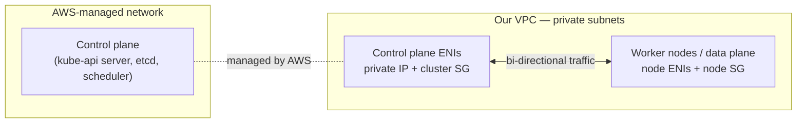

## How users access the cluster (public and private)

To run `kubectl` against the cluster, you connect to the cluster's **kube-api server endpoint**. EKS can expose that endpoint in two ways — and you can enable either or both.

**Public endpoint** — the cluster gets a **public DNS / HTTPS endpoint**, so you can reach the kube-api server from outside the VPC (e.g. from your local machine). When public access is enabled you can also restrict it with a **CIDR allowlist** — `0.0.0.0/0` to allow from anywhere, or a specific IP (like your office/home IP) to lock it down.

**Private endpoint** — the kube-api server is reachable only via a **private DNS endpoint inside the VPC**. To use `kubectl` from outside, you go through a **bastion / jump host** in a public subnet (or a VPN/SSM tunnel). This is the more secure option and is **recommended for production**.

**Worker nodes:** because the private endpoint is enabled in this setup, the worker nodes always talk to the control plane over the **private endpoint**, keeping that traffic inside the VPC.

**My setup:** for simplicity, I enable **both** the public and private endpoints, with the public endpoint open to `0.0.0.0/0`, so I can run `kubectl` from my local machine.

**For production:** a **private-only endpoint accessed through a bastion host** is preferred. If public access is ever needed, the CIDR should be restricted to specific IPs rather than left open to `0.0.0.0/0`.

## How EKS decides who can access the cluster (authentication mode)

`authentication_mode` controls **how EKS decides who is allowed to access the cluster**. It has three possible values:

- **`CONFIG_MAP`** — the old way: you edit an in-cluster `aws-auth` ConfigMap to map IAM users/roles to Kubernetes groups.
- **`API`** (the new, recommended way — used here) — you create **EKS Access Entries** for an IAM user/role and attach an EKS access policy (e.g. Admin or View). No `aws-auth` editing: you just tell AWS *who* can access (the Access Entry) and *at what level* (the access policy).
- **`API_AND_CONFIG_MAP`** — a hybrid where both Access Entries and the `aws-auth` ConfigMap work together. Mainly useful during a migration.

**Key point:** having admin on the **AWS account** does **not** automatically grant admin on the **EKS cluster**. Cluster access is separate and must be granted explicitly through Access Entries.

How access is granted in this project:

- **`enable_cluster_creator_admin_permissions = true`** — automatically gives the IAM identity that runs Terraform (my `devops` user, the cluster creator) **admin access** to the cluster by creating an Access Entry for it. Without this, even the creator wouldn't be able to access the cluster.
- **`access_entries`** — used to grant **additional** IAM users/roles access. For example, the AWS account **root user** has full account access but **no** cluster access by default, so an Access Entry is added for it here. Any other users/roles that need cluster access are added the same way.

So if a **developer** needs to access the cluster, we add an **Access Entry for their IAM user/role** here and attach the right access policy (e.g. `View` for read-only, `Admin` for full access). They don't get cluster access just from having an IAM user — it has to be granted explicitly via an Access Entry.

## IAM roles (control plane and data plane each need their own)

EKS uses **two separate IAM roles** — one for the **control plane** and one for the **data plane** (worker nodes). They do completely different jobs, so each gets only the permissions it needs (least privilege).

**Cluster IAM role (control plane)**
- Assumed by the EKS **control plane** itself.
- Lets EKS manage AWS resources **on your behalf** — for example creating and managing the ENIs and other resources the cluster needs.
- Key policy: `AmazonEKSClusterPolicy`.

**Node IAM role (data plane / worker nodes)**
- Assumed by the **EC2 worker nodes** (the kubelet on each node).
- Lets the nodes join the cluster and make the AWS calls they need. Key policies:
  - `AmazonEKSWorkerNodePolicy` — lets a node register with and talk to the control plane.
  - `AmazonEKS_CNI_Policy` — lets the VPC CNI assign VPC IPs / ENIs to pods.
  - `AmazonEC2ContainerRegistryReadOnly` — lets nodes pull container images from ECR.

So the control plane role is about EKS managing infrastructure for you, while the node role is about the worker machines being able to join the cluster, network the pods, and pull images. (These are different from **IRSA** below, which gives individual *pods* their own roles.)

# IRSA — IAM Roles for Service Accounts

**What is IRSA?** IRSA lets a Kubernetes **pod get its own AWS permissions through its ServiceAccount**, instead of borrowing the node's IAM role.

- **Without IRSA:** pods inherit AWS permissions from the **EC2 node IAM role**, which is shared by everything on that node and is usually too broad — a security risk.
- **With IRSA:** each workload gets its **own small IAM role** (least privilege), e.g. "this pod can only read this one S3 bucket."

The whole thing boils down to one chain:

> **ServiceAccount → short-lived token (OIDC/JWT) → AWS STS → temporary AWS credentials for an IAM role**

### The pieces

- **ServiceAccount** — an identity *inside Kubernetes* that pods run as. It is **not** an AWS user, so you can't attach an IAM role to it directly in AWS. Instead you **annotate** it with the role ARN:
  `eks.amazonaws.com/role-arn: arn:aws:iam::<acct>:role/<role>`
- **OIDC token (JWT)** — when a pod starts, Kubernetes mounts a **short-lived signed token** into it. The token says: "I am ServiceAccount X in namespace Y", "this token is for audience `sts.amazonaws.com`", and "I expire soon."
- **IAM OIDC provider** — the EKS cluster exposes an **OIDC issuer URL**. You register an **IAM OIDC provider** in AWS that points to it; this is the **trust bridge** that lets AWS verify the Kubernetes-issued token. (OIDC doesn't turn the ServiceAccount into an AWS object — it just makes the token verifiable.)
- **AWS STS (Security Token Service)** — the AWS service that hands out **temporary credentials**. The pod calls `AssumeRoleWithWebIdentity` with the JWT + the role ARN; STS verifies it and returns short-lived creds.
- **`aud` (audience)** — "who is this token for?" Must be `sts.amazonaws.com`, so STS accepts it.
- **`sub` (subject)** — "who does this token belong to?" It looks like `system:serviceaccount:<namespace>:<serviceaccount>`. The IAM role's **trust policy** uses `sub` to ensure only that **specific ServiceAccount** can assume the role.

### End-to-end flow

1. The EKS cluster has an OIDC issuer URL; enabling IRSA registers an **IAM OIDC provider** for it.
2. You create an **IAM role** whose trust policy says: *trust tokens from this cluster's OIDC provider, but only if `aud = sts.amazonaws.com` and `sub = system:serviceaccount:<ns>:<name>`.*
3. You **annotate the ServiceAccount** with that role's ARN.
4. A pod using that ServiceAccount gets a **short-lived JWT** (mounted via a projected volume).
5. The AWS SDK in the pod calls **STS `AssumeRoleWithWebIdentity`** with the token and the role ARN.
6. STS verifies the token (signature via the OIDC provider, plus the `aud` and `sub` checks) and returns **temporary AWS credentials**.
7. The app uses those temporary credentials to call AWS services.

The result: **pod-level, least-privilege AWS access — without ever using the node's IAM role.**

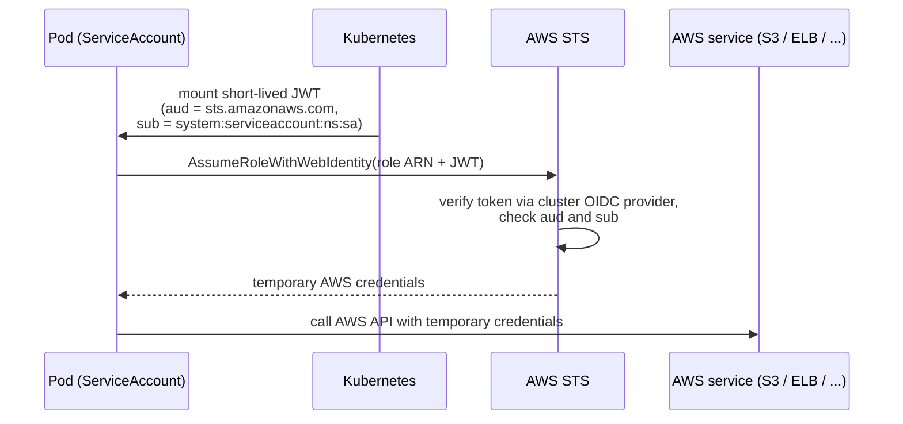

### Where IRSA is used here

IRSA is used whenever a workload in the cluster needs AWS access. For example, the **AWS Load Balancer Controller** needs ELB/EC2 permissions; or, more simply, if an **application running in a pod needs to read from an S3 bucket**, you give its ServiceAccount an IAM role scoped to just that bucket — so the pod can access that one bucket and nothing else. Each workload gets its own ServiceAccount annotated with a dedicated least-privilege IAM role.

## Choosing the node group instance type and min/max/desired size (pod limits)

The number of pods a node can run depends on its **instance type** — a bigger instance type allows **more pods** (the limit is tied to how many ENIs/IPs the instance supports for the VPC CNI).

Also important: when the cluster starts, several **system pods** (CoreDNS, kube-proxy, VPC CNI, etc.) are scheduled automatically and **count toward that pod limit** — so the room left for your own app pods is smaller than the raw maximum. This has to be kept in mind when picking the instance type and the node count (min/max/desired).

AWS provides a **max-pods calculator** script to check the pod limit per instance type:

```bash
AWS_PROFILE=<your-profile> ./max-pods-calculator.sh \
  --instance-type t3.micro \
  --cni-version 1.9.0-eksbuild.1 \
  --region us-east-1
# e.g. t3.micro -> only 4 pods allowed
```

For example, a `t3.micro` allows only ~4 pods — and with the system pods using some of those, almost nothing is left for the app. That's why the instance type and node count are chosen with the pod limit in mind.

## Connecting kubectl to the cluster (kubeconfig)

To run `kubectl`/`helm` against the cluster, you point your local kubeconfig at it:

```bash
AWS_PROFILE=fleetman-prod aws eks update-kubeconfig --region us-east-1 --name fleetman-eks-cluster
```

This updates your local kubeconfig (`~/.kube/config`) by adding/updating three things:

- the **cluster** entry — the API server endpoint + the cluster CA,
- the **user** entry — an exec plugin that calls AWS to fetch a short-lived token,
- the **context** that ties the cluster and user together.

You can then copy that generated entry into a kubeconfig of your own naming and `export KUBECONFIG=...` in your terminal to make it the active config.

---

# EKS Add-ons

**What are EKS add-ons?** Add-ons are AWS-managed pieces of operational software that the cluster needs to function (DNS, networking, storage, etc.). Instead of installing and upgrading these yourself, EKS manages their whole lifecycle — install, configuration, and version upgrades — as cluster add-ons.

The add-ons installed in this cluster:

- **CoreDNS** — in-cluster DNS for service discovery (lets pods find each other and services by name)
- **kube-proxy** — manages network routing rules on each node so traffic reaches the right pods
- **vpc-cni** — assigns VPC IP addresses to the pods (Amazon VPC networking for pods)
- **eks-pod-identity-agent** — lets pods assume IAM roles (pod identity)

Of these, **CoreDNS, kube-proxy, and vpc-cni** are the **default, essential** ones — a cluster basically can't run normally without DNS, node networking, and pod IP assignment. `eks-pod-identity-agent` is added on top, for pod-level IAM access.

---

# Docker

For our three microservices — **API Gateway**, **Position Simulator**, and **Position Tracker** — we build a **Docker image** for each.

The great thing about a Docker image is that it **encapsulates the entire application into one image**: it contains the source code *and* all the dependencies the application needs to run. The image has everything the app needs, so it runs the same way everywhere.

Once an image is built, we can push it to a **registry** — Docker Hub or **Amazon ECR**. From there, we can deploy the application easily anywhere using that image — an on-prem Docker host, a Kubernetes cluster, or the cloud.

In this project, each of the three apps has its own **Dockerfile**, and the built images are pushed to the **ECR repositories created via Terraform**.

## How a Java app works (using the API Gateway as the example)

Java is a **compiled** language, so there's an extra step: you can't just "run the source." The code must first be **compiled and packaged** into an artifact (a `.jar`), and then the Java runtime runs that.

The API Gateway is a **Spring Boot app (Java 8)**, built with **Maven**:

1. You write the `.java` source.
2. **Maven compiles** it (`.java` → `.class` bytecode) and **packages** it into a single JAR.
3. Because it's Spring Boot, that JAR is a **"fat JAR" (uber JAR)** — one self-contained file containing your compiled code, **all** dependency libraries, **and an embedded Tomcat web server**. So there's no separate server to install.

At runtime, the **JRE** executes the bytecode and the **embedded Tomcat** serves HTTP on **port 8080**.

| File | Purpose |
|------|---------|
| `pom.xml` | Dependencies + build configuration (Maven) |
| `src/` | The Java source code |
| `target/*.jar` | The built fat JAR, produced by `mvn package` |
| `Dockerfile` | Recipe to build the container image |

## Deploying it manually (without Docker)

1. Build the JAR:
   ```bash
   mvn package          # produces target/fleetman-0.0.1-SNAPSHOT.jar
   ```
2. Copy that JAR to the server.
3. Install a **JRE** on the server (e.g. `apt install openjdk-8-jre`).
4. Run it:
   ```bash
   java -jar fleetman-0.0.1-SNAPSHOT.jar   # embedded Tomcat listens on 8080
   ```
5. In production you'd run it as a **systemd service** so it stays up and restarts on crash/reboot.

The pain: every server needs the **exact right Java version** and setup, and you manage the JAR + service by hand — the classic "works on my machine" problem.

## Why Docker is better here

Docker packages the **JRE + the JAR + everything the app needs** into a single **image**. That image runs **identically everywhere** — your laptop, any Docker host, a Kubernetes cluster, or the cloud — with no need to install or match the right Java version on each server. Build once, run anywhere.

## The Dockerfile (API Gateway)

```dockerfile
# ---------- Stage 1: build ----------
FROM maven:3.6.3-jdk-8-slim AS build
WORKDIR /app

# Copy only the pom first and pre-download dependencies (cached layer).
COPY pom.xml ./
RUN mvn -q -B dependency:go-offline

# Now copy the source and build the jar (tests skipped for the image build)
COPY src ./src
RUN mvn -q -B -DskipTests package

# ---------- Stage 2: runtime ----------
FROM eclipse-temurin:8-jre-alpine
LABEL org.opencontainers.image.authors="Priyanshi Sarad <itspriyanshisarad@gmail.com>"

# Create a non-root user/group and an app dir it owns (security best practice)
RUN addgroup -S app && adduser -S app -G app \
    && mkdir -p /app && chown app:app /app

WORKDIR /app
# Copy the jar out of the build stage and give ownership to the app user
COPY --chown=app:app --from=build /app/target/*.jar app.jar

USER app

EXPOSE 8080
ENTRYPOINT ["java", "-jar", "app.jar"]
```

## Dockerfile breakdown

It's a **multi-stage build** — a heavy "build" stage that compiles the JAR, and a small "runtime" stage that just runs it.

Why multi-stage: the build tools (Maven, JDK) and source code stay in the build stage and are **thrown away** — only the final jar is carried into the runtime image. This keeps the final image **much smaller**, gives it a **smaller attack surface** (no compilers/source shipped to production), and makes it faster to push and pull.

**Build stage**
- `FROM maven:3.6.3-jdk-8-slim AS build` — an image with **Maven + JDK**, needed to compile the code.
- `COPY pom.xml` then `mvn dependency:go-offline` — downloads all dependencies **first**, as its own layer. Docker caches layers, so this only re-runs when `pom.xml` changes — everyday **code edits don't re-download dependencies**, which makes rebuilds fast.
- `COPY src` then `mvn -DskipTests package` — compiles and builds the fat JAR at `/app/target/*.jar`.

**Runtime stage**
- `FROM eclipse-temurin:8-jre-alpine` — a tiny **JRE-only Alpine** image: just enough to *run* Java, with no JDK/Maven/source → a small, more secure final image.
- `addgroup`/`adduser` + `USER app` — creates and switches to a **non-root user**, so the app never runs as root (security best practice).
- `mkdir + chown /app` and `COPY --chown=app:app ...` — the **`app` user owns** both the working directory and the jar.
- `COPY --from=build .../*.jar app.jar` — copies **only the built jar** from the build stage (no build tooling in the final image) and renames it `app.jar` (the wildcard avoids hardcoding the version).
- `EXPOSE 8080` — documents the port the embedded Tomcat listens on.
- `ENTRYPOINT ["java","-jar","app.jar"]` — runs the app. The **exec form** (JSON array) makes `java` run as **PID 1**, so it receives stop signals for a clean shutdown.

The **Position Tracker** uses the same Dockerfile. The **Position Simulator** is identical but **without `EXPOSE`**, since it doesn't serve HTTP — it only sends messages to the queue.

## Building and pushing the image to ECR (manual)

> Note: these are the **manual** build-and-push steps. In this project this is done **automatically via AWS CodePipeline** — the steps below are just to show what happens under the hood.

First set the registry and region (replace `<account-id>` with your AWS account ID):

```bash
export AWS_PROFILE=fleetman-prod
export AWS_REGION=us-east-1
export ECR=<account-id>.dkr.ecr.us-east-1.amazonaws.com
```

**1. Log in to ECR** (authenticates Docker to your private registry):

```bash
aws ecr get-login-password --region "$AWS_REGION" --profile fleetman-prod \
  | docker login --username AWS --password-stdin "$ECR"
```

**2. Build the image** (run from the service folder, tagging it with the ECR repo URL):

```bash
cd k8s-fleetman-api-gateway
docker build -t "$ECR/fleetman-api-gateway:v1" .
```

**3. Push it to ECR:**

```bash
docker push "$ECR/fleetman-api-gateway:v1"
```

Repeat for the other two services from their folders:

```bash
cd ../k8s-fleetman-position-simulator
docker build -t "$ECR/fleetman-position-simulator:v1" .
docker push "$ECR/fleetman-position-simulator:v1"

cd ../k8s-fleetman-position-tracker
docker build -t "$ECR/fleetman-position-tracker:v1" .
docker push "$ECR/fleetman-position-tracker:v1"
```

The image tags start with `v` (e.g. `v1`, `v2`) so they match the ECR **lifecycle policy** (keep the latest 5 `v*`-tagged images).

---

# Deploying to Kubernetes

Now that we have a final Dockerfile for each service, CodePipeline builds the image and pushes it to ECR automatically. The next question is *where* and *how* to run those images — and that's the Kubernetes cluster we created on EKS.

All three services (API Gateway, Position Simulator, Position Tracker) are deployed as a deployment, using a **Deployment set**.

## Why a Deployment set?

To understand the Deployment set, it helps to start one level below it — the ReplicaSet.

### ReplicaSet

A ReplicaSet's only job is to keep a **desired number of identical pods running and healthy** — even if that number is just 1. If a pod crashes or a node dies, the ReplicaSet notices the count has dropped and brings a new pod back up. This is what gives us **self-healing** and high availability.

A ReplicaSet handles and manages pods — but a Kubernetes cluster can have many pods running at once. So how does it know *which* pods it's responsible for? That's where **labels and selectors** come in: the ReplicaSet's selector must match the labels on the pod template, and it manages exactly the pods whose labels match.

```yaml
apiVersion: apps/v1
kind: ReplicaSet
metadata:
  name: frontend
  labels:
    app: guestbook
    tier: frontend
spec:
  replicas: 3
  selector:               # how the ReplicaSet finds its pods
    matchLabels:
      tier: frontend       # must match the pod's labels
  template:                # pod template
    metadata:
      labels:
        tier: frontend     # pod labels
    spec:
      containers:
        - name: php-redis
          image: us-docker.pkg.dev/google-samples/containers/gke/gb-frontend:v5
```

A ReplicaSet is **namespaced** — it only manages pods in its own namespace.

The catch: a ReplicaSet **can't roll out updates**. If you change the image, it won't gracefully move from the old version to the new one. That's exactly the gap the Deployment set fills — so we never use a ReplicaSet directly; we wrap it inside a Deployment set.

### Deployment set

A **Deployment set** sits on top of the ReplicaSet and manages it for us. It keeps the ReplicaSet alive (recreating it if deleted) and, on top of plain self-healing, it adds the two features we actually want in production:

- **Rolling updates** — move from one version to the next with **zero downtime**.
- **Rollbacks** — go back to a previous version quickly if something breaks.

So the chain of ownership is: **Deployment set → ReplicaSet → Pods → Container**.

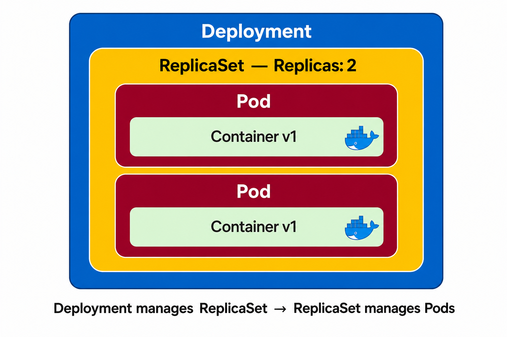

A minimal Deployment set looks almost like a ReplicaSet, just with `kind: Deployment`:

```yaml
apiVersion: apps/v1
kind: Deployment
metadata:
  name: myapp-deployment
spec:
  replicas: 3
  selector:
    matchLabels:
      app: myapp
  template:
    metadata:
      labels:
        app: myapp
    spec:
      containers:
        - name: myapp
          image: myapp:v1
```

## Rolling updates (zero downtime)

When you change the image tag (say `v1` → `v2`) and re-apply the Deployment set, here's what happens:

1. The Deployment set creates a **brand-new ReplicaSet** for `v2` and starts bringing up its pods.
2. It waits until the new `v2` pods are **up, healthy, and accepting traffic**.
3. Only then does it scale the old `v1` ReplicaSet down to **0 replicas** — which removes the old pods.

Because traffic isn't switched over until the new pods are ready, there's **no downtime** during the update.

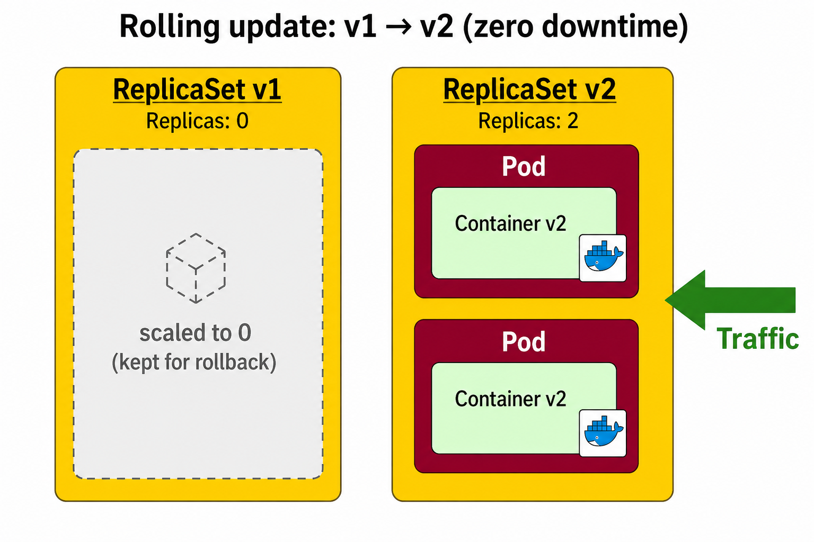

Two important details:

- The image **tag must change** between versions (`v1`, `v2`, …). If the tag is the same, the Deployment set sees no change and the zero-downtime rollout/rollback machinery has nothing to work with.
- The old ReplicaSet **isn't deleted** — it's just scaled to `0`. Keeping it around is what makes instant rollbacks possible.

```bash
kubectl rollout status  deploy/webapp   # watch the rollout finish
kubectl rollout history deploy/webapp   # see past revisions
```

## Rollbacks (and why the site stays up even on a bad deploy)

Because the old ReplicaSet is still there at `0` replicas, rolling back is just scaling it back up:

```bash
kubectl rollout undo deploy/webapp                 # go back one revision
kubectl rollout undo deploy/webapp --to-revision=2 # go to a specific revision
```

Kubernetes keeps the **last 10 revisions** by default, so you can move back and forth between versions. It's also smart enough not to create a new ReplicaSet when you're just flipping between versions it already has.

The really nice part is what happens on a **bad deploy**. Say `v2` points at an image tag that doesn't exist — the new pods fail with `ErrImagePull` / `ImagePullBackOff`. Since the Deployment set only shifts traffic **after** the new pods are healthy, and these never become healthy, traffic **keeps going to the old `v1` pods**. The site stays up, and you get plenty of time to fix the problem.

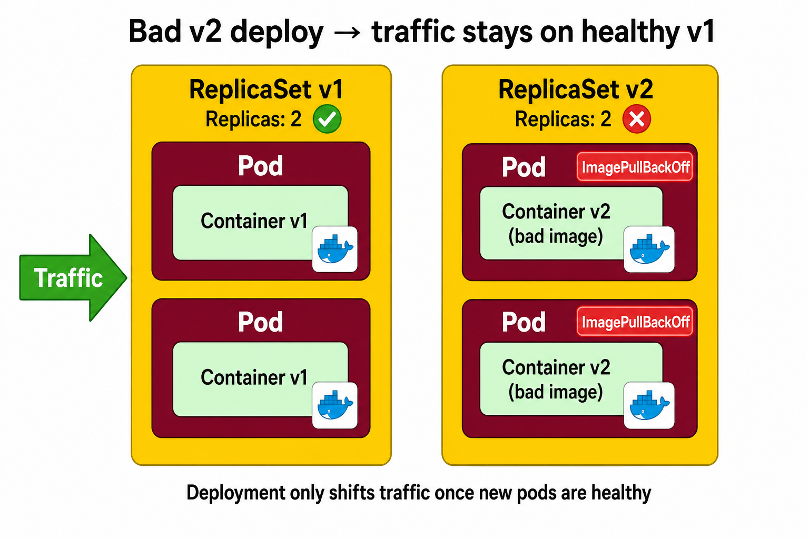

> `kubectl rollout undo` is for emergencies. For normal updates the deploy is driven by **CI/CD (CodePipeline + Helm)**, so what's running in the cluster always matches the version-controlled manifests.

## Namespaces

A **namespace** lets you divide a single cluster into logical, isolated groups — almost like virtual clusters inside the real one. They keep resources organised, avoid name clashes (two namespaces can each have a Service called `fleetman-position-tracker`), and let you scope access and resource limits per group.

Our whole application is deployed into one dedicated namespace: **`fleetman-prod`**.

## How the three microservices talk to each other

Inside the cluster, EKS uses the **Amazon VPC CNI** as its container networking solution. Instead of a separate overlay network, the VPC CNI gives **every pod a real private IP straight from the VPC private subnet** where its worker node runs — the same private subnets our node group lives in. So pods are first-class members of our VPC network.

Because all pods share this one private network, **any pod can reach any other pod directly by its private IP — regardless of namespace**.

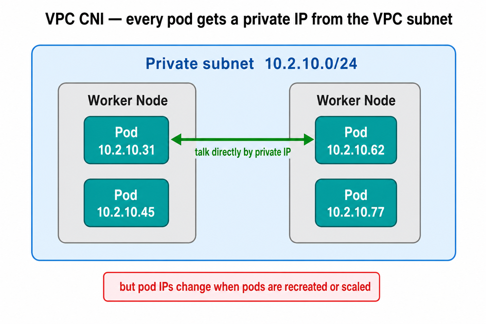

The problem: **pod IPs aren't stable**. Pods get deleted, recreated, rescheduled, and scaled up and down — and each time a pod can come back with a **new IP**. If our code or config hard-coded a pod's IP, it would break constantly. We need something with a **stable address**. That's a Kubernetes **Service** of type **ClusterIP**.

### Service (ClusterIP)

A **ClusterIP Service** gives a **stable, cluster-internal virtual IP and a stable DNS name** that stay fixed for the life of the Service — even as the pods behind it come and go. The Service selects its backend pods by **label** and load-balances traffic across them.

We don't use the IP for communication (an IP can still change if the Service is recreated) — we use the **DNS name**.

In this project, the in-cluster call is the **API Gateway → Position Tracker**: the gateway reaches the tracker at the Service name `fleetman-position-tracker:8080`, never at a pod IP. (The Simulator and Tracker don't call each other directly — they communicate through the **ActiveMQ queue** — and the Tracker reaches **MongoDB Atlas** outside the cluster.)

A ClusterIP Service for the Position Tracker looks like this:

```yaml
apiVersion: v1
kind: Service
metadata:
  name: fleetman-position-tracker
  namespace: fleetman-prod
spec:
  type: ClusterIP
  selector:              # how the Service finds its pods
    app: fleetman-position-tracker
  ports:
    - port: 8080         # the port the Service exposes
      targetPort: 8080   # the port on the pod it forwards to
```

**How does the Service know which pods to send traffic to?** A cluster has many pods running, so the Service uses the same idea as a ReplicaSet — **labels and selectors**. The Service's `selector` matches a label on the pods (here `app: fleetman-position-tracker`), and it routes traffic only to the pods whose labels match.

**Traffic flow.** A request from the API Gateway pod doesn't go straight to a Tracker pod — it goes to the **Service first**, and the Service forwards it on to a matching pod:

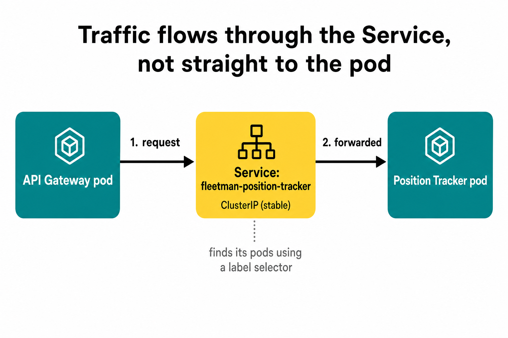

This indirection is exactly what makes pods replaceable: because everyone talks to the **stable Service**, pods behind it can come and go without anyone needing to know their IPs.

**Load balancing.** If the Position Tracker is scaled to several pods, the Service automatically **spreads requests across all of them** — one stable address in front, many pods behind it:

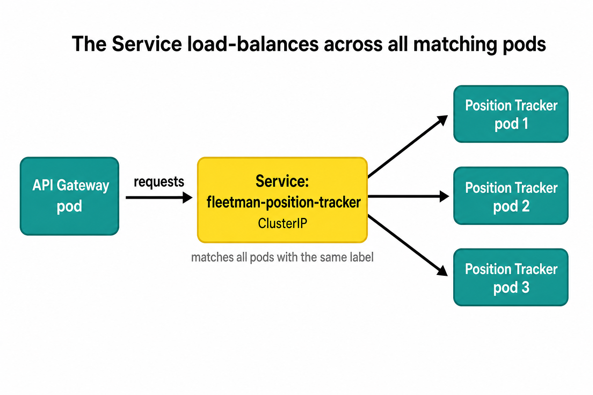

### CoreDNS

Those stable DNS names are resolved by **CoreDNS**, the cluster's built-in DNS server. CoreDNS runs as pods in the **`kube-system`** namespace and is fronted by a Service called **`kube-dns`**. Kubernetes keeps every Service's DNS name mapped to its ClusterIP, and CoreDNS serves those records.

So when the API Gateway connects to `fleetman-position-tracker`:

1. it does a **DNS lookup** to CoreDNS for that name,
2. CoreDNS responds with the Service's **ClusterIP**,
3. the gateway connects to that stable ClusterIP,
4. the Service **forwards** the request to one of the Position Tracker pods.

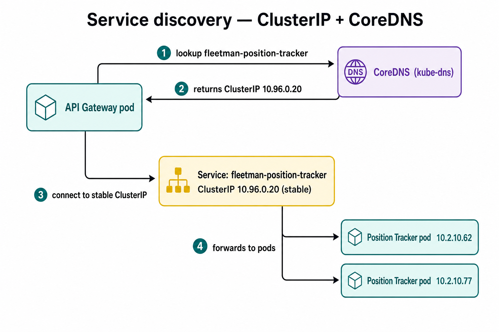

How does a pod know *where* CoreDNS is? When Kubernetes creates a pod, it **pre-configures** the container's `/etc/resolv.conf` with a `nameserver` entry pointing at the `kube-dns` ClusterIP. You can see it from inside any pod:

```bash
kubectl exec -it <pod-name> -- cat /etc/resolv.conf
# nameserver <kube-dns ClusterIP>   <- this is CoreDNS
```

### Fully Qualified Domain Name (FQDN)

A Service isn't actually registered under the bare name `fleetman-position-tracker`. Its full DNS name (the **FQDN**) follows the pattern:

```
<service-name>.<namespace>.svc.cluster.local
```

So our tracker's real record is `fleetman-position-tracker.fleetman-prod.svc.cluster.local`, where `cluster.local` is our cluster's DNS domain.

Short names still work because `/etc/resolv.conf` adds **search domains**, so Kubernetes expands them for you:

- **Same namespace** → just `fleetman-position-tracker`
- **Different namespace** → `fleetman-position-tracker.fleetman-prod`
- **Anywhere** → the full FQDN above

```bash
nslookup fleetman-position-tracker                                 # same namespace
nslookup fleetman-position-tracker.fleetman-prod                   # cross-namespace
nslookup fleetman-position-tracker.fleetman-prod.svc.cluster.local # full FQDN
```

### A quick note on Service types and Endpoints

There are three common Service types:

- **ClusterIP** — internal pod-to-pod communication (what we use here).
- **NodePort** — exposes a fixed port on every node's IP.
- **LoadBalancer** — provisions a cloud load balancer (on AWS, a native ELB) for external access.

Behind every Service is an **Endpoints / EndpointSlice** object that lists the actual pod `IP:port`s the Service routes to. It's handy for debugging:

```bash
kubectl get endpoints fleetman-position-tracker -o wide
```

If that shows `<none>`, the Service's **selector doesn't match any Ready pods**, so traffic has nowhere to go — a common reason a Service "isn't working".

---

# Handling environment variables

Each microservice needs some configuration at runtime — which Spring profile to load, the ActiveMQ broker URL and credentials, the MongoDB connection string, and so on. We don't bake these into the Docker image; we pass them in as **environment variables** so the same image can run in any environment. Kubernetes gives us two objects for this: **ConfigMap** for non-sensitive config and **Secret** for sensitive config.

## ConfigMap (non-sensitive config)

A **ConfigMap** holds plain key–value configuration. We load all of its keys into the container as environment variables (`envFrom → configMapRef`), so each key becomes an env var the app can read. In this project the ConfigMap carries things like `SPRING_PROFILES_ACTIVE`, `ACTIVEMQ_BROKER_URL`, and (for the API Gateway) `POSITION_TRACKER_URL`.

A ConfigMap for the API Gateway looks like this:

```yaml
apiVersion: v1
kind: ConfigMap
metadata:
  name: fleetman-api-gateway
  namespace: fleetman-prod
data:
  SPRING_PROFILES_ACTIVE: "production-microservice"
  POSITION_TRACKER_URL: "http://fleetman-position-tracker:8080"
```

The Deployment then pulls every key from that ConfigMap into the container as env vars using `envFrom`:

```yaml
apiVersion: apps/v1
kind: Deployment
metadata:
  name: fleetman-api-gateway
  namespace: fleetman-prod
spec:
  replicas: 1
  selector:
    matchLabels:
      app: fleetman-api-gateway
  template:
    metadata:
      labels:
        app: fleetman-api-gateway
    spec:
      containers:
        - name: fleetman-api-gateway
          image: <account-id>.dkr.ecr.us-east-1.amazonaws.com/fleetman-api-gateway:v1
          ports:
            - containerPort: 8080
          envFrom:
            - configMapRef:
                name: fleetman-api-gateway   # loads every key above as an env var
```

## Secret (sensitive config)

A **Secret** works the same way but is meant for **sensitive** values and is kept base64-encoded. It's loaded into the container as env vars too (`envFrom → secretRef`). The sensitive values here are `ACTIVEMQ_USER`, `ACTIVEMQ_PASSWORD`, and `MONGODB_URI` (the Atlas connection string includes the password).

## How the app picks them up

Spring Boot reads environment variables directly. `SPRING_PROFILES_ACTIVE=production-microservice` selects the active profile, and the property files use `${VAR:default}` fallbacks — so an env var overrides the default when present:

```properties
spring.activemq.broker-url=${ACTIVEMQ_BROKER_URL:tcp://fleetman-queue:61616}
spring.activemq.user=${ACTIVEMQ_USER:}
spring.activemq.password=${ACTIVEMQ_PASSWORD:}
spring.data.mongodb.uri=${MONGODB_URI:mongodb://fleetman-mongodb:27017/fleetman}
```

The ConfigMap is rendered by the **Helm chart** from the values file (the `configmap.data` block), so a service's config lives in one place.

## My strategy

**Non-sensitive variables → ConfigMap.** These hold no secrets, so the ConfigMap (in the Helm values) is **committed to the repo**. That keeps configuration version-controlled and makes it easy for developers to read and change.

**Sensitive variables → not a Kubernetes Secret.** A Kubernetes Secret is only **base64-encoded, not encrypted** — base64 is trivially reversible, so it isn't real protection, and if a Secret manifest is committed to Git the credentials are effectively exposed. Kubernetes Secrets also have no built-in rotation or audit trail. So I keep credentials out of the cluster manifests entirely and store them in **AWS**, which gives two managed options: **SSM Parameter Store** and **Secrets Manager**.

| | SSM Parameter Store | AWS Secrets Manager |
|---|---|---|
| Built for | General config + secrets | Purpose-built for secrets |
| Cost | Free (standard tier) | Paid (per secret + API calls) |
| Encryption | Optional (`SecureString` via KMS) | Always encrypted (KMS) |
| Automatic rotation | Not built in | Built-in rotation support |
| Audit / fine-grained access | Basic | Strong (IAM + rotation + audit) |
| Best for | Simple, cost-sensitive config | Sensitive credentials |

For this project's sensitive values I use **AWS Secrets Manager**, since it's purpose-built for secrets and supports encryption, rotation, and auditing out of the box.

## Using AWS Secrets Manager for sensitive values

---

# CI/CD with CodePipeline

The three backend services (API Gateway, Position Tracker, Position Simulator) run on the EKS
cluster, and each one has its own **AWS CodePipeline** that takes a code change all the way to
the cluster — **build the image, push it to ECR, and deploy it with Helm** — with no manual
steps. Without this you'd have to log in to ECR, `docker build`, `docker push`, then run
`helm upgrade` by hand for every change; the pipeline does all of that consistently and
records every run.

There is **one pipeline per service**, so a change to one service only rebuilds and redeploys
that service:

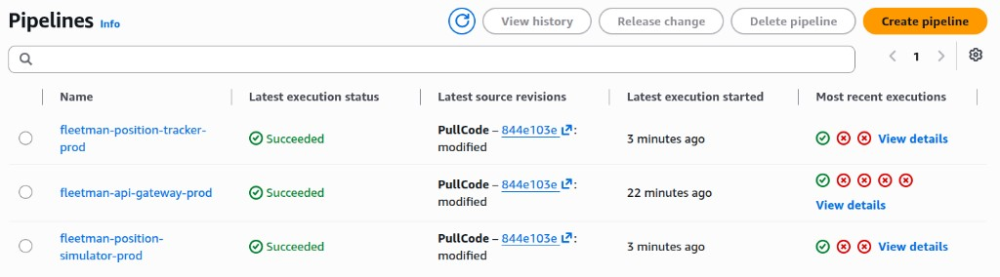

## The stages

Each service's pipeline has three stages: **Source → Build → EKSDeploy**.

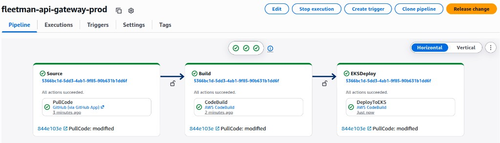

**1. Source** — A **GitHub connection** (CodeStar Connection) watches the repository. When the
pipeline runs it pulls the repo and saves it as the `source_output` artifact. Because this is a
monorepo, that artifact contains **all** the services' folders.

**2. Build** (CodeBuild, runs the service's `buildspec.yml`) — logs in to ECR, builds the
Docker image, tags it, and pushes it. The tag is generated as
`v<short-commit-sha>-<timestamp>` (e.g. `v844e1-12-41-26-06-23`) so every build is unique and
traceable back to a commit. It then writes that tag into `image-tag.txt` and packages the files
the deploy stage will need into the `build_output` artifact.

**3. EKSDeploy** (CodeBuild, runs `eks-deployspec.yml`) — installs `kubectl` + Helm, points
`kubectl` at the cluster (`aws eks update-kubeconfig`), reads the tag from `image-tag.txt`, and
runs a single `helm upgrade --install` to deploy that exact image tag (this is the same Helm
command described in [Deploying with Helm](#deploying-with-helm)).

## The build and deploy specs

The Build stage runs each service's `buildspec.yml`:

```yaml
version: 0.2
phases:
  pre_build:
    commands:
      - aws ecr get-login-password --region ${REGION} | docker login -u AWS --password-stdin ${ECR_LOGIN}
  build:
    commands:
      - cd k8s-fleetman-api-gateway
      - TAG="v${CODEBUILD_RESOLVED_SOURCE_VERSION:0:5}-$(date +%I-%M-%y-%m-%d)"
      - docker build -t ${ECR_REPOSITORY_URI}:${TAG} .
  post_build:
    commands:
      - docker push ${ECR_REPOSITORY_URI}:${TAG}
      - printf "%s" "${TAG}" > image-tag.txt
artifacts:
  files:
    - image-tag.txt
    - eks-deployspec.yml
    - helm-chart/**/*
  base-directory: k8s-fleetman-api-gateway
```

The EKSDeploy stage runs `eks-deployspec.yml`:

```yaml
version: 0.2
phases:
  install:
    commands:
      - set -euo pipefail
      - curl -sSL -o kubectl "https://dl.k8s.io/release/$(curl -sSL https://dl.k8s.io/release/stable.txt)/bin/linux/amd64/kubectl"
      - install -m 0755 kubectl /usr/local/bin/kubectl
      - HELM_VERSION="v4.0.4"
      - curl -sSL "https://get.helm.sh/helm-${HELM_VERSION}-linux-amd64.tar.gz" -o helm.tar.gz
      - tar -xzf helm.tar.gz
      - install -m 0755 linux-amd64/helm /usr/local/bin/helm
  pre_build:
    commands:
      - test -f image-tag.txt
      - IMAGE_TAG="$(cat image-tag.txt)"
      - test -d "$HELM_CHART_PATH"
      - aws eks update-kubeconfig --region "$AWS_REGION" --name "$EKS_CLUSTER_NAME"
      - kubectl -n "$K8S_NAMESPACE" get pods >/dev/null
  build:
    commands:
      - helm upgrade --install "$HELM_RELEASE_NAME" "$HELM_CHART_PATH" --namespace "$K8S_NAMESPACE" -f "$HELM_VALUES_FILE" --set image.repository="$ECR_REPOSITORY_URI" --set image.tag="$IMAGE_TAG" --wait --timeout 10m --force-conflicts
      - kubectl -n "$K8S_NAMESPACE" rollout status deploy -l "app.kubernetes.io/instance=$HELM_RELEASE_NAME" --timeout=10m || true
```

The environment variables these specs use (`ECR_REPOSITORY_URI`, `ECR_LOGIN`, `REGION`,
`AWS_REGION`, `EKS_CLUSTER_NAME`, `K8S_NAMESPACE`, `HELM_RELEASE_NAME`, `HELM_CHART_PATH`,
`HELM_VALUES_FILE`) are injected by the CodeBuild projects, so the same specs work for every
service.

## How the monorepo is handled

Everything lives in one repository, so the Source stage hands the **whole repo** to CodeBuild.
CodeBuild does **not** guess which `buildspec.yml` to use — by default it looks for one at the
artifact root, which doesn't exist here. So each CodeBuild project is told the **exact path** to
the service's buildspec, derived automatically from the service name:

```hcl
# the build project points at the right service folder
buildspec = "k8s-fleetman-${var.app}/buildspec.yml"   # e.g. k8s-fleetman-api-gateway/buildspec.yml
```

The build commands also `cd` into the service folder before `docker build`, and the artifacts
are collected with `base-directory: k8s-fleetman-<service>` so the deploy files land at the root
of `build_output` where the deploy stage expects them.

## Base images come from ECR Public (not Docker Hub)

The Dockerfiles pull their base images (`maven`, `eclipse-temurin`) from the **Amazon ECR
Public** mirror rather than Docker Hub:

```dockerfile
FROM public.ecr.aws/docker/library/maven:3.9-eclipse-temurin-21 AS build
FROM public.ecr.aws/docker/library/eclipse-temurin:21-jre-alpine
```

Docker Hub enforces **anonymous pull rate limits** by source IP, and CodeBuild runs on shared
AWS IPs — so builds would intermittently fail at the `FROM` line with a rate-limit / manifest
error. ECR Public hosts the **same** Docker Official Images (identical tags), isn't throttled
the same way, and is network-close to CodeBuild. (The original Docker Hub versions are kept as
`Dockerfile-dev` for local development.)

## Giving the pipeline access to the cluster

The deploy stage runs as the pipeline's IAM role, but **IAM permissions alone don't grant
access to the Kubernetes API**. Our cluster uses EKS **`authentication_mode = API`**, where
access is controlled by **EKS Access Entries**. So the CodePipeline role is added as an access
entry; without it `kubectl`/`helm` are rejected with *"the server has asked for the client to
provide credentials"*.

Because the app charts include an **`ExternalSecret`** (a Custom Resource from the External
Secrets Operator), the entry is associated with **cluster-admin** — AWS's namespace-scoped
managed policies map to Kubernetes' built-in `admin` role, which doesn't cover CRDs. The entry
is built in Terraform and references the role created in the same layer:

```hcl
# Infrastructure/main/eks.tf
codepipeline = {
  principal_arn = module.iam-assumable-role-codepipeline.iam_role_arn
  policy_associations = {
    cluster_admin = {
      policy_arn   = "arn:aws:eks::aws:cluster-access-policy/AmazonEKSClusterAdminPolicy"
      access_scope = { type = "cluster" }
    }
  }
}
```

## Artifacts and the artifacts bucket

CodePipeline stages don't share a disk — each stage runs in its own fresh container. They pass
work to the next stage through **artifacts**, which CodePipeline stores in a dedicated **S3
bucket** (one bucket shared by all the pipelines). The two artifacts here are:

| Artifact | Produced by | Contains | Used by |
|---|---|---|---|
| `source_output` | Source | the pulled repo | Build |
| `build_output` | Build | `image-tag.txt`, `eks-deployspec.yml`, `helm-chart/` | EKSDeploy |

This is why the build packages `image-tag.txt` and the Helm chart into `build_output` — the
deploy stage's container never sees the original repo, only this artifact. The bucket is simply
the hand-off point between stages.

## Permissions the pipeline needs

The pipeline's IAM role is granted exactly what the stages do:

| Permission | Why |
|---|---|
| S3 (artifacts bucket) | read/write the `source_output` and `build_output` artifacts between stages |
| ECR | log in, push the built image, and let the cluster pull it |
| CloudWatch Logs | CodeBuild streams each build/deploy's logs to CloudWatch so runs are debuggable |
| EKS (`DescribeCluster`) | so `aws eks update-kubeconfig` can configure access in the deploy stage |
| CodeStar Connection | so the Source stage can pull from GitHub |
| IAM (PassRole) | so CodePipeline can hand the CodeBuild projects their service role |

CloudWatch Logs access in particular is what makes the build output (every command and its
result) visible in the console — without it CodeBuild fails up front because it can't create its
log stream.

## Running the pipeline

A pipeline runs automatically on a new commit, or you can start it manually with the
**Release change** button in the CodePipeline console (top-right in the screenshots above). It
re-pulls the latest commit from the source branch and runs Source → Build → EKSDeploy.

---

# Deploying with Helm

So far we've talked about the Kubernetes objects (Deployment, Service, ConfigMap, …). The plain way to create them is to write a YAML manifest for each one and run `kubectl apply`. Instead, this project deploys everything with **Helm**.

## What is Helm?

**Helm is the package manager for Kubernetes.** A package is called a **Helm chart** — a bundle of *templated* Kubernetes manifests plus a values file that fills in the blanks. Rather than hard-coding every manifest, you write the manifests once with placeholders (`{{ .Values.image.tag }}`), and Helm renders them using the values you supply. A deployed instance of a chart is called a **release**, which Helm tracks and can upgrade or roll back as a single unit.

## Plain manifests vs a Helm chart

With plain manifests, every object is its own static file, and you'd repeat them for each service (and again for each environment) — lots of near-duplicate YAML with hard-coded values:

```text
k8s-manifests/
├── api-gateway-deployment.yaml
├── api-gateway-service.yaml
├── api-gateway-configmap.yaml
├── position-simulator-deployment.yaml
├── position-simulator-configmap.yaml
├── position-tracker-deployment.yaml
├── position-tracker-service.yaml
└── position-tracker-configmap.yaml
```

With Helm, each service ships a small chart that uses **one set of templates** driven by a values file. Here's the chart layout we use (each microservice has its own `helm-chart/` with the same template structure):

```text
helm-chart/
├── Chart.yaml                 # chart metadata: name, version, appVersion
├── values/
│   └── prod-values.yaml       # the values (image, ports, env, replicas, probes…)
└── templates/
    ├── _helpers.tpl           # reusable snippets (resource names, labels)
    ├── deployment.yaml        # the Deployment (pods, image, env, probes)
    ├── service.yaml           # the ClusterIP Service
    ├── configmap.yaml         # non-sensitive env config
    ├── secret.yaml            # sensitive env (optional)
    └── hpa.yaml               # HorizontalPodAutoscaler (optional)
```

## What each file does

- **`Chart.yaml`** — metadata about the chart: its `name`, `version`, and `appVersion`. In our charts the chart `name` also drives the names of the created resources (e.g. the Service ends up named `fleetman-position-tracker`).
- **`values/prod-values.yaml`** — the **knobs**. All the per-service, per-environment settings live here: image repository and tag, service port, replica count, the env vars (rendered into the ConfigMap), probe toggles, etc. Swapping this one file (e.g. a `dev-values.yaml`) reuses the exact same templates for a different environment.
- **`templates/`** — the Kubernetes manifests, written with `{{ }}` placeholders that Helm fills from the values file:
  - **`deployment.yaml`** → the Deployment (which pods to run, the image, env, probes).
  - **`service.yaml`** → the ClusterIP Service in front of the pods.
  - **`configmap.yaml`** → the non-sensitive environment config.
  - **`secret.yaml`** → sensitive values (created only when enabled).
  - **`hpa.yaml`** → autoscaling rules (created only when enabled).
  - **`_helpers.tpl`** → shared template helpers (consistent names and labels) reused by the other templates.

## Why Helm

- **No duplication (DRY)** — one templated chart instead of many copy-pasted manifests; the same chart works for all three services.
- **Parameterised per environment** — the same templates + a different values file (`prod`, `dev`, …) means no editing of the actual manifests to change an environment.
- **One release, deployed atomically** — `helm upgrade --install` creates or updates the whole set of objects together, and Helm keeps a **revision history** so you can `helm rollback` to a previous release if something breaks.
- **Cleaner CI/CD** — the deploy step is a single Helm command instead of applying a pile of files.

A deploy is just one command (this is exactly what CodePipeline runs in `eks-deployspec.yml`):

```bash
helm upgrade --install fleetman-position-tracker ./helm-chart \
  --namespace fleetman-prod \
  -f helm-chart/values/prod-values.yaml \
  --set image.tag="$IMAGE_TAG"
```

`upgrade --install` means: install the release if it doesn't exist yet, otherwise upgrade it in place.

# Deploying the webapp (CloudFront + S3)

## What the webapp is

The webapp is the **Angular** frontend, written in **TypeScript** (Angular compiles it down to the JavaScript, HTML and CSS that run in the browser). It shows a **map with the vehicles moving on it in real time**, and the **trace of the route each vehicle is taking as it moves** (drawn as a trail/line on the map). It doesn't store anything itself; it simply connects to the **API Gateway**, receives live position updates, and draws them on the map.

It is **both a Single Page Application (SPA) and a static site** — these aren't opposites, they describe two different things:

- **SPA** = *how the app works.*
- **Static** = *how it's hosted after you build it.*

## It's a Single Page Application (SPA)

A **Single Page Application** serves **one HTML file** (`index.html`) once, and from then on the **browser** runs the app and renders every screen using JavaScript. The server is no longer asked for new pages — only for data.

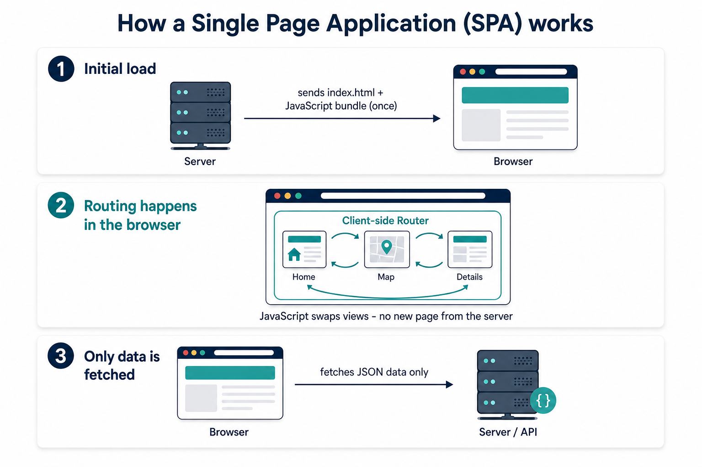

### The "app shell": one index.html

`index.html` is the **app shell** — a near-empty page whose only job is to be a **mount point** for the app and to load the JavaScript and CSS bundles. In Fleetman (Angular) the entire `src/index.html` body is just:

```html
<body>
  <app-root></app-root>
</body>
```

`<app-root>` is the empty slot Angular fills in. (In a React app the same idea is `<div id="root"></div>`.) The shell then loads:

- the **JS bundle** — the compiled app code + the routing logic + the code that calls the backend APIs, and
- the **CSS bundle** — the compiled styles (plus static assets like images/fonts).

The actual **dynamic content is not inside the bundle** — the bundle fetches it from the APIs at runtime.

### Client-side rendering and client-side routing

Two pieces do the work in a typical SPA (React shown as the classic example; Angular works the same way):

- **The UI library** (React / Angular) is the **rendering engine** — it decides what HTML to show based on the app's state and renders it into the DOM (`<App />` into `#root`, or Angular components into `<app-root>`). This is **client-side rendering**: the HTML is built in the **browser**, which is what makes navigation feel instant.
- **The router** (e.g. React Router) is the **navigation controller** — it watches the browser URL and decides which screen/component to render for that path. The key point: **routing happens in the browser, not on the server.**

### Step by step: how a SPA loads and navigates

**1. First load (cold load)** — the user opens `https://app.example.com/` (or a deep link like `/users/42`):

```text
Browser ── GET / ───────────────▶ Host
Browser ◀── 200, index.html ───── Host          (the app shell)
Browser ── GET /assets/app.js ──▶ Host
Browser ── GET /assets/app.css ─▶ Host
Browser ◀── 200 (real files) ──── Host          (these ARE real files)
        │
        ▼
   JS boots ▶ mounts the app into <app-root> ▶ router reads the URL ▶ renders the screen
```

**2. Navigating inside the app (no refresh)** — the user clicks a link, e.g. `/users` → `/users/42`:

```text
Click ▶ Router uses the History API (pushState) ▶ URL changes to /users/42
        │   (NO request to the host for HTML)
        ▼
   React / Angular renders the new screen in the same already-loaded page
        │
        ▼   (only if that screen needs data)
   fetch() / XHR ──▶ Backend API ──▶ returns JSON      (data, not a webpage)
```

No new HTML page is downloaded — it's the same `index.html` and the same JS runtime. Only **API data** travels over the network. That's why SPAs feel fast.

**3. Refresh or a direct deep link** — the user refreshes on `/users/42`, opens it in a new tab, or hard-navigates:

```text
Browser ── GET /users/42 ───────▶ Host
```

Now the browser **does** ask the host for `/users/42`. But `/users/42` is **not a real file** — it's **just a path** (a client-side route that only the in-browser router understands). On disk the host only has `index.html` and the `/assets/*` files; there is no `users/42` file or folder sitting on the server. So for the SPA to work, the host must return **`index.html` with `200 OK`** for any such app route, and then let the in-browser router take over and render `/users/42`. (Requests for real files under `/assets/*` are still served normally.) This "**return `index.html` for app routes**" behaviour is the one special thing hosting an SPA needs — how that's configured for this project is covered further below.

### How this maps to Fleetman

Fleetman is an **Angular SPA**: one `index.html` with `<app-root>`, a JS bundle that renders the map and vehicle list **in the browser**, and live vehicle data pulled from the **API Gateway** (REST + WebSocket) at runtime.

> Accuracy note: Fleetman is a **simple single-view SPA** — it renders everything client-side, but it does **not** define multiple routes (there is no Angular Router in its code), so it has no deep links like `/users/42`. The routing steps above describe SPAs **in general** (an admin dashboard is the classic multi-route example). The app-shell + client-side-rendering model is identical, and so is the way you host it.

## ...and it builds into static files (what "static" means)

When you run `npm run build`, Angular compiles the whole app into a small set of plain files: `index.html`, some `.js`, and some `.css`. That bundle **is** the website.

"**Static**" means those files are served **exactly as they are** — the server doesn't run any code, talk to a database, or build anything per request. Every visitor gets the same files, and all the actual work (drawing the map, updating markers) happens **in the browser**.

This is the opposite of the backend Java microservices, which **run code on the server** for every request (read the queue, query MongoDB, calculate speed). The webapp has none of that on the server side — it's just files.

## Why deploying it on EKS is not necessary

Because it's a **static SPA**, there is nothing to "run" on the server side — no JVM, no Node process, no long-running pod. Putting it on EKS would mean keeping a web-server pod alive just to hand out a few unchanging files, which is wasteful. All it actually needs is:

1. **Somewhere to store the files**, and
2. **Something to serve them quickly over HTTPS.**

So unlike the three backend services (which genuinely need Kubernetes to run their processes), the webapp does **not** need EKS.

### How you could serve it without AWS

Since it's just files after building, **any web server can serve it**:

```bash
cd k8s-fleetman-webapp-angular
npm ci
npm run build      # produces the dist/ folder of static files
```

That `dist/` folder **is** the bundle — the whole website as plain files. It typically contains:

- `index.html` — the app shell
- the **JS bundle(s)** — the compiled app code (e.g. `runtime.js`, `polyfills.js`, `main.js`, often with content hashes like `main.abc123.js`)
- the **CSS bundle** — the compiled styles (e.g. `styles.css`)
- an `assets/` folder — static files like images, fonts, marker icons

These are exactly the static files a web server hands to the browser.

Then either:

- Copy the contents of `dist/` into a web server like **Nginx** (e.g. `/usr/share/nginx/html/`) and it serves them, **or**
- Build an **Nginx Docker image** that compiles the app and serves `dist/` with Nginx.

```bash
docker build -t fleetman-webapp .
docker run -p 8080:80 fleetman-webapp   # open http://localhost:8080
```

> **Either way**, the webapp needs to reach the **API Gateway** to get live vehicle data. On a non-AWS setup that's whatever exposes the gateway (a Kubernetes Service / NodePort, or a local URL). The map only shows movement when it can reach that backend.

## Deploying it on AWS with CloudFront + S3

For this project we host the static SPA on **Amazon S3 + CloudFront** instead of EKS:

- **Amazon S3** — a **private** bucket that simply **stores** the built files (`index.html`, JS, CSS).
- **Amazon CloudFront** — a **CDN** that sits in front of the bucket and **serves** the files to users. It caches them at edge locations close to the user (fast everywhere), provides **HTTPS** with an ACM certificate, and adds security headers. CloudFront is the only thing allowed to read the bucket, so the bucket itself stays private.

### What a CDN is (and why CloudFront)

A **CDN (Content Delivery Network)** is a worldwide network of caching servers called **edge locations**. Your files physically live in **one** place — the S3 bucket in a single AWS region (the **origin**). Without a CDN, a user on the other side of the world would have to fetch every file all the way from that one region, which is slow. CloudFront fixes this by **caching copies of your files at edge locations around the globe** and serving each user from the **edge nearest to them**.

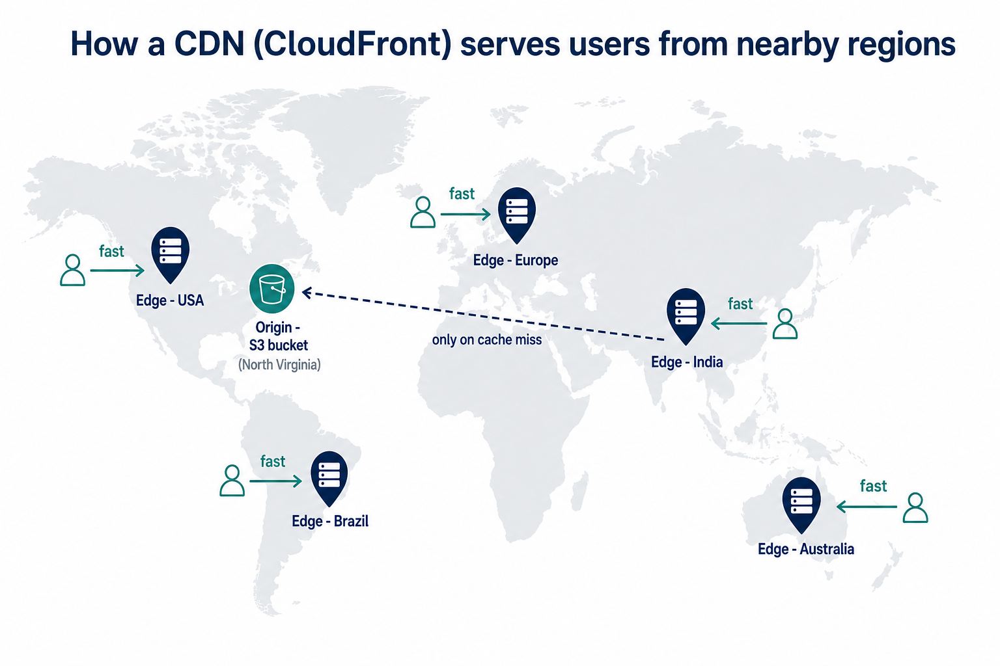

**How a request flows:**

1. A user requests the site. CloudFront automatically routes them to the **nearest edge location**.
2. **Cache hit** — if that edge already has the file, it returns it immediately; the request never travels to the origin. This is the fast, common case.
3. **Cache miss** — if the edge doesn't have it yet (e.g. the first visitor in that region), the edge fetches it **once** from the **origin (the S3 bucket)**, sends it to the user, and **stores it in its cache** so the next visitors in that region get it instantly.

**Why this matters:**

- **Faster for everyone** — files travel a short hop from a nearby edge instead of across the planet, so the site loads quickly no matter where the user is.
- **Less load on the origin** — most requests are answered by the edge caches, so the S3 bucket is barely touched.
- **Scales with traffic** — the global edge network absorbs spikes instead of hammering one region.

When you ship a new version of the site, you tell CloudFront to **invalidate** the cache, so the edges drop their old copies and pull the fresh files from the origin on the next request.

### Provisioning & deploys

The S3 bucket and CloudFront distribution are provisioned with **Terraform** (`Infrastructure/`), and new changes deploy automatically via **AWS CodePipeline** (Source → Build → S3 → CloudFront invalidate).
